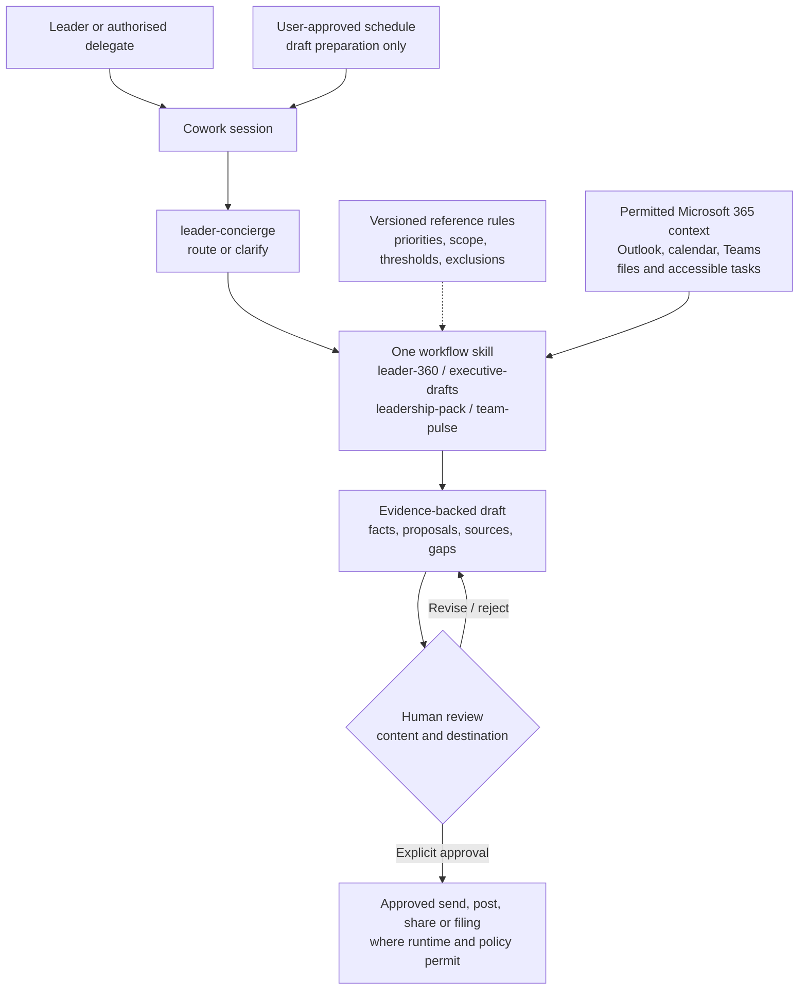

# Chief of Staff Cowork Agent - Architecture

## Configuration-First Architecture

The skills are configuration inside Cowork, not five services or autonomous agents. A plugin
packages related skills and may include connectors; it does not grant access to underlying
data. No custom Azure infrastructure, database, or search index is introduced in the base design.

## Components and Access

| Component | Role | Qualification |
|---|---|---|
| Cowork | Session, tool use, skill discovery, built-in artifact capabilities | Supported pilot surface and tenant availability |
| Entra identity | Signed-in user and permitted organisation context | Test leader and delegate separately; verify direct-report mapping |
| Outlook/calendar | Decisions, asks, commitments, upcoming meetings | Mailbox/delegation access and exclusions |
| Teams | Permitted conversations, recaps, meeting evidence | Meeting category, consent, transcript availability and retention |
| SharePoint/OneDrive | Reports, trackers, existing packs and skill references | Source permissions, latest version, output classification |
| Planner/To Do or other approved task surface | Open/waiting/overdue actions | Prove retrieval in the actual Cowork tenant; direct app access alone is insufficient |
| Skill/plugin package | Routing and repeatable output contracts | Approved version, trusted provenance, all companion references present |
| Scheduled prompts | Agreed repeated preparation | Owner, timezone, period, stop control and run evidence |

## Evidence and Output Contracts

Retain a source link or identifiable reference and timestamp for each material item. Resolve
contradictory versions explicitly; a later message is not always the authoritative decision.
Keep an "unavailable or excluded sources" section so a polished pack does not imply completeness.

| Artifact | Minimum structure |
|---|---|
| Leader 360 | Reporting window/as-of, upcoming-week dashboard, results update, risk lens, ranked first moves, source ledger/gaps |
| Executive draft | Audience and purpose, point first, grounded evidence, explicit ask, draft status |
| Leadership pack | Narrative, decision log, risk table, action register, metrics, sources and gaps |
| Team pulse | Per-report observable work and blockers, dated evidence, visibility limitations, suggested follow-up questions |

The evidence lookback and the upcoming calendar week are different windows: name both.
An inferred priority may be labelled a proposal; an unconfirmed owner or due date remains unset.
An outline is not a generated Word/PowerPoint file. Validate files only when generation is
included and supported, using existing approved templates.

## Approval and People-Safety Boundaries

Reading permitted context does not authorise redistribution. Review the recipient audience and
the output's sensitivity independently of source access. Record exact preview, approver,
destination, action, and result without copying private source content into operational logs.

People-related guidance is limited to documented work and blockers. Directory hierarchy and
message activity cannot establish productivity, health, engagement, or performance. A user
request to rank employees must be declined, not converted into a disguised score.

For any action on the never-automate list, the operational control must match the documented
rule. If Cowork or the chosen tool can execute without required approval, disable that route or
leave the action to the human; a prompt prohibition is insufficient.

## Scheduling and Failure Behaviour

- Approved default: Monday 08:00 local, with explicit timezone and daylight-saving treatment.
- An on-demand run uses the same agreed evidence and calendar windows as the scheduled run.
- Scheduling means repeated draft preparation, not unrestricted autonomous execution.
- Missing permission, unavailable skill, empty evidence, or policy/cost block must be reported.
  Do not switch identities, reuse an old brief as current, or imply all sources were searched.
- Prevent duplicate schedules during reinstall. Pause owned schedules before rollback; restore
  the approved skill/reference version and validate in a new session.

## Related Design Guidance

- [Shared skill and schedule pattern](../../02-patterns/Cowork-Skill-Delivery-and-Scheduled-Reviews/Cowork-Skill-Delivery-and-Scheduled-Reviews.md)
- [Review and approval pattern](../../02-patterns/Human-in-the-Loop-Review-and-Approval/Human-in-the-Loop-Review-and-Approval.md)
- [Delivery runbook](3.Runbook.md)
