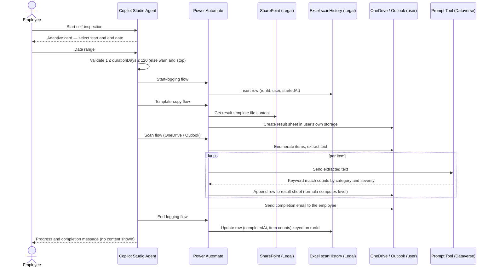
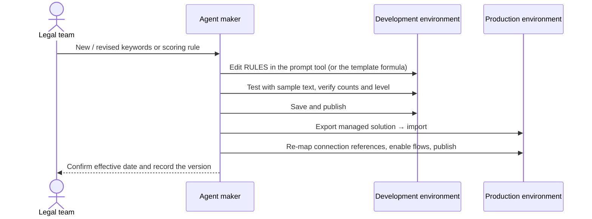

# Compliance Self-Inspection Agent — Architecture

## 1. Logical Architecture

The agent operates across three layers: the **User Layer** (how employees and Legal interact), the **Agent Layer** (Copilot Studio topics, prompt tool, and flow orchestration), and the **Data & Tool Layer** (OneDrive, Outlook, SharePoint, Excel, Dataverse).

```text
┌────────────────────────── USER LAYER ──────────────────────────┐
│  Employee (Microsoft 365 Copilot / Teams / shared chat link)   │
│  Legal team (SharePoint workbook: completion status only)      │
└───────────────┬────────────────────────────────────────────────┘
                │  starts self-inspection
┌───────────────▼────────────────── AGENT LAYER ─────────────────┐
│  Copilot Studio agent                                          │
│   ├─ Topic: Self-Inspection          → adaptive card asks for  │
│   │                                    the date range, then    │
│   │                                    validates it (≤ 120 d)  │
│   ├─ Flow: Record Inspection Start → logs start time            │
│   ├─ Flow: Copy Self-Inspection Result Template → result sheet  │
│   ├─ Flow: Scan OneDrive Files → scans own documents            │
│   ├─ Flow: Scan Emails and Attachments → scans own mail         │
│   ├─ Prompt: Compliance Keyword Analysis → taxonomy, counts     │
│   └─ Flow: Record Inspection Completion → logs completion       │
└───────────────┬────────────────────────────────────────────────┘
                │  connectors
┌───────────────▼─────────────── DATA & TOOL LAYER ──────────────┐
│  OneDrive for Business  → employee's own documents (end-user)  │
│  Outlook                → employee's own mail (end-user)       │
│  Dataverse              → prompt tool execution (see §5.2)     │
│  SharePoint (Legal)     → result template file (maker)         │
│  Excel Online (Legal)   → scanHistory workbook (maker)         │
└────────────────────────────────────────────────────────────────┘
```

---

## 2. Key Components

| Component | Technology | Role |
|---|---|---|
| **Agent runtime** | Microsoft Copilot Studio | Hosts topics, instructions, and flow orchestration; drives the conversation |
| **Keyword analysis prompt tool** | AI Builder `Compliance Keyword Analysis` (Dataverse-hosted), GPT-4.1 mini | Holds the `RULES` keyword taxonomy as JSON and returns per-keyword match counts for a supplied text block |
| **Text-extraction prompts** | AI Builder `Extract Text from DOCX`, `Extract Text from XLSX`, `Extract Text from PPTX`, `Extract Text from PDF`, all GPT-5 chat | Extract text from the supported document formats before keyword analysis |
| **Scan flows** | Power Automate (`Scan OneDrive Files`, `Scan Emails and Attachments`) | Enumerate the employee's files and mail for the selected date range, extract text, call the prompt tool, write rows into the result sheet, and send the completion email |
| **Start / end logging flows** | Power Automate + Excel Online (`Record Inspection Start`, `Record Inspection Completion`) | Write and then update a row in the `scanHistory` table (run id, user, start time, completion time, counts). New run IDs use `guid()` without a prefix. Timestamps are stored in KST via `formatDateTime(addHours(utcNow(), 9), 'yyyy-MM-dd HH:mm:ss')` |
| **Template copy flow** | Power Automate + SharePoint (`Copy Self-Inspection Result Template`) | Copies the Legal-owned result template into the employee's own storage for this run |
| **Result template** | `self-inspection-result-template.xlsx` in a Legal-owned SharePoint site | Defines the result-sheet layout **and** holds the risk-scoring formula (in the first data row of the `riskLevel` column) |
| **Execution history workbook** | `self-inspection-history.xlsx` in a Legal-owned SharePoint site | `scanHistory` table: one row per run — run id, user, name, start, completion, item counts |
| **Delivery surface** | Microsoft 365 Copilot, Microsoft Teams, or a shared agent link | Where employees launch the agent |

### Supported Content and Extraction Scope

| Format | Scanned | Included | Excluded |
|---|---|---|---|
| Word (`.docx`) | ✅ | All body text | Text embedded in images |
| Excel (`.xlsx`) | ✅ | All cell text | Text embedded in images |
| PowerPoint (`.pptx`) | ✅ | Text boxes, tables, slide notes | Text embedded in images |
| PDF (`.pdf`) | ✅ | Text-layer content | Scanned/image-only pages |
| Email | ✅ | Message body and supported attachments | Image-only attachments |

> ⚠️ **Common rule:** across every format, content stored as **text** is scanned; content stored as an **image** is not. There is no OCR stage in the baseline design.

### Scan Window

The user selects a start and end date on an adaptive card before the scan begins. The topic validates that the selected `durationDays` is **between 1 and 120 days** (default limit); out-of-range input returns a warning and the run is not started.

120 days is a starting point, not a platform ceiling. If the organization's inspection cycle needs a longer look-back — a half year, for example — the limit can be raised; treat it as a tuning parameter and re-measure run time and API volume with realistic data before applying the new value to production (see §4).

> ⚠️ Flows are attached as **nodes inside the `Self-Inspection` topic**, not registered as agent tools. Consequently, credentials are configured on each flow's **connection references** only — the tool-level "credentials to use" setting does not apply to this agent.

---

## 3. Data Flow

### Scenario A — Employee-initiated self-inspection



### Scenario B — Legal team keyword or rubric update



---

## 4. Customization Surface

Everything below is changeable without writing code.

| What you can change | Where | Cautions |
|---|---|---|
| **Keyword list** | Prompt tool → `RULES` JSON, per category and severity | Adding/removing words inside an existing category is safe. Adding or removing a **category** also requires changes to the flows and the result-template columns. Build and test the change in a **separate copy of the prompt tool**, then port the validated `RULES` into the live one. |
| **Keyword counting / aggregation logic** | Prompt tool instructions | Validate with multiple test cases; model-authored aggregation logic must be verified before promotion. After running a test, re-open the **Code** view to confirm the edited `RULES` were actually captured, and check the model response against the declared output format. |
| **Risk banding and rules** | Result template — the formula in the `riskLevel` column's first data row | The formula is filled down; change one cell, verify the whole column |
| **Result-sheet layout** | Result template workbook | Adding surrounding text is trivial. Adding or removing **table columns** requires matching changes in the scan flows. |
| **Scan-window limit (default 120 days)** | `Self-Inspection` topic — **three** places: ① the condition node comparing `durationDays`, ② the over-limit warning message, ③ the adaptive-card guidance text | Only ① changes behaviour, but all three must carry the same number or the UI contradicts the runtime. The limit is meant to be tuned to the organization's inspection cycle and can be raised moderately; because a longer window increases scan duration and connector API volume, measure the elapsed time with real data in development first and watch for connector throttling and flow time-outs. |
| **Completion email wording** | Scan flow (`Scan Emails and Attachments` / `Scan OneDrive Files`) → "send completion email" action body | — |
| **In-conversation progress messages** | Scan flow (`Scan Emails and Attachments` / `Scan OneDrive Files`) → "respond to agent" action | Keep document content out of these messages (see §7) |
| **Template and result storage locations** | Solution environment variables consumed by `Copy Self-Inspection Result Template` | Set the SharePoint site URL, plain template path, and OneDrive output-folder path during import (see below). The SharePoint action uses **Get file content using path**, not an encoded file identifier. |
| **History workbook location** | Excel Online actions in `Record Inspection Start` and `Record Inspection Completion` | Select the site/location, document library, `self-inspection-history.xlsx`, and table (`scanHistory`) through the flow designer dropdowns in **both** flows. These connector-specific IDs are deliberately not environment variables. Re-selecting a file resets advanced parameters, so re-map `id`, `userEmail`, `userName`, `startedAt` / `completedAt`, `emailBody`, `emailAttachments`, `onedriveFiles` afterwards. |

### Import-time Storage Configuration

| Environment variable | Schema name | Value to supply |
|---|---|---|
| Self-Inspection SharePoint Site URL | `dv_SelfInspectionSharePointSiteUrl` | Full site URL, such as `https://contoso.sharepoint.com/sites/Compliance` |
| Self-Inspection Template Path | `dv_SelfInspectionTemplatePath` | Plain site-relative path, such as `/Shared Documents/self-inspection-result-template.xlsx` |
| Self-Inspection Output Folder | `dv_SelfInspectionOutputFolder` | Folder path in the employee's OneDrive; retain the existing folder or choose a target folder |

The variables are **Text** definitions without defaults. Omit their current values from distribution exports so the solution import wizard can collect target-environment values; existing target values can be reused on an update. No SharePoint, drive, file, or table GUID needs to be typed into these variables. The Excel history bindings still require the two designer selections described above after import, and result-table bindings must match the copied template.

Generated result filenames use `<yyyyMMdd_HHmmss>_self-inspection-result_<start-yyyyMMdd>_<end-yyyyMMdd>.xlsx`. The filename change does not rename or move the existing OneDrive output folder. `Purge AI Event Table` remains off and is not called by the scan flows.

---

## 5. Security & Governance

### 5.1 Access Model

| Principle | Implementation |
|---|---|
| **Self-inspection only** | The agent can only be run by an employee against their own workspace; there is no "scan user X" path |
| **Per-user isolation** | OneDrive, Outlook, and prompt-tool calls execute under **end-user credentials**, so the platform itself enforces that a user reaches only their own data |
| **Legal sees metadata only** | Legal has access to the `scanHistory` workbook (who ran, when, how many items) and to the result-template file — never to an individual's result sheet |
| **Shared-credential exceptions** | Only the SharePoint template read and the Excel history write use **maker credentials**, because employees must write completion evidence into a Legal-only location without gaining access to it |
| **AI Event write suppressed** | In a dedicated production environment, custom security roles remove Create/Read/Write on the Dataverse `AI Event` (`msdyn_aievent`) table, so prompt input and output are never persisted for anyone to read |

### 5.2 Connector Credential Matrix

| Connector / usage | Credential | Reason |
|---|---|---|
| Outlook (read own mail) | **End user** | Own data only; distributes per-user API limits |
| OneDrive (read own files, write result sheet) | **End user** | Own data only; distributes per-user API limits |
| Dataverse — prompt-tool invocation from `Scan Emails and Attachments` and `Scan OneDrive Files` | **Maker** in the shared prototype environment · **End user** once a dedicated production environment is in place | End-user execution spreads prompt-call throughput across users instead of throttling one account, and is what makes the restricted `AI Event` permissions effective. It requires the maker to hold the **Delegate** role — see §5.6. |
| SharePoint (read result template, `Copy Self-Inspection Result Template`) | **Maker** | Template lives in a Legal-only site |
| Excel Online (write `scanHistory`, start and end logging flows) | **Maker** | History workbook lives in a Legal-only site |

> 💡 If every connector runs on a single maker account, all employees' requests share that account's service limits and the agent will throttle under load. End-user credentials are a **scalability** requirement, not only a security one.

> ℹ️ Once a user approves connections on a published channel, the connection typically remains valid for around 90 days. Connections created in the Copilot Studio test pane expire after a few hours.

### 5.3 Sensitive-Data Exposure Points

Because the agent processes document and mail text, four platform locations must be assessed. Three carry raw content; the fourth does not, **as long as the design constraint holds**.

| # | Location | What is exposed | Who can see it | Control |
|---|---|---|---|---|
| **01** | **Flow run history** (last 28 days) | Full input/output of every action, including document body and mail text | Flow owners and co-owners, environment/system admins, makers who can edit the solution | Minimize owners and co-owners; restrict environment admin to a named IT list; apply secure input/output (#03); set the Dataverse **cloud flow run history (FlowRun TTL)** feature to *disabled* so run metadata does not accumulate in the environment; track access via audit log |
| **02** | **AI events** (prompt-tool run records in Dataverse) | Text submitted to the prompt and the generated analysis output | Anyone with read access to the relevant Dataverse table, environment/system admins, prompt-tool editors | **Primary control:** custom security roles (copies of *Basic User* and *Environment Maker*) with Create/Read/Write set to **None** on `AI Event` (`msdyn_aievent`), so records are neither written nor readable. Once this is in place, the child flow that used to purge AI Event rows must be **removed** from `Scan Emails and Attachments` and `Scan OneDrive Files` — leaving it causes run-time errors. Additionally: explicitly manage the maker/admin roster, agree retention and purge cadence with Legal, and pass only the text needed for classification |
| **03** | **Connector action input/output** | Raw file content, mail subject and body, attachment text, intermediate variables | Everyone who can open run history; makers who test flows | Enable **secure inputs / secure outputs** on sensitive actions (values are masked in run history); avoid copying full content into variables; run tests only in the development environment |
| **04** | **Conversation transcripts** (Dataverse) | User/agent dialogue turns, topic path | Transcript readers, environment admins | **Out of scope by design** — the conversation carries only launch and progress messages. File paths are passed, content is processed inside the flows, and results go to a file and an email. If a future change surfaces content or result summaries in chat, this assessment must be redone. |

> ✅ **Fastest high-impact control:** enabling secure inputs/outputs on the content-bearing actions simultaneously reduces exposure at points 01, 02, and 03.

### 5.4 Environment Strategy

| Option | Strengths | Considerations |
|---|---|---|
| **Single production environment** (recommended) | One version for everyone; a fix reaches all users immediately; permissions and run history auditable in one place; managed solution blocks in-place edits; organization-wide completion tracking in one workbook | All runs share one environment's capacity and limits; an environment security group is mandatory; assign co-owners or a service account against owner departure; keep maker access in a separate development environment |
| **Per-user developer environments** | Run data physically separated per user; one user's consumption cannot affect another; small blast radius for trials | Deployment and updates repeat per person; version drift; organization-wide completion tracking becomes impractical; every user needs maker rights and licensing |

For an organization-wide program with a Legal-side completion requirement, the **single production environment** is the default; per-user environments are appropriate only for a small maker-led experimentation phase.

### 5.5 Required Platform Settings

| # | Setting | Purpose |
|---|---|---|
| 01 | **Environment security group** | Only designated users can access the production environment |
| 02 | **DLP policy** | Permit business connectors only; block the rest |
| 03 | **Managed deployment** | Production receives managed solutions only, so nobody edits live |
| 04 | **Sharing scope** | Share to a named group, or publish through the organization's agent registry |
| 05 | **Ownership succession** | Assign co-owners so the solution survives an owner's departure |
| 06 | **Environment-scoped custom security roles** | Copies of *Basic User* and *Environment Maker* with `AI Event` (`msdyn_aievent`) Create/Read/Write set to **None** — never edit the built-in roles, as they are tenant-wide |
| 07 | **Delegate role for the maker** | Required for the "run-only user provided" connection mode used by the scan flows |
| 08 | **Cloud flow run history (FlowRun TTL) disabled** | Prevents run metadata from accumulating in Dataverse and consuming storage on every execution |
| 09 | **Prompt tool shared with agent users** | The prompt tool is owned by the maker; without explicit sharing, user runs fail with a permission error at the prompt-call step |

### 5.6 Production Cutover Responsibilities

Moving to a **dedicated production environment** requires more than solution import (§5.4), connection setup (§5.2), and sharing. The work splits cleanly between two owners; the IT admin tasks must complete first, or the maker tasks fail with permission errors.

| Area | Task | Owner |
|---|---|---|
| Permissions | Create environment-scoped custom security roles by copying *Basic User* and *Environment Maker*, then set `AI Event` Create/Read/Write to **None** | IT admin |
| Permissions | Grant the **maker**: the Environment Maker-based custom role, the Basic User-based custom role, and the **Delegate** role | IT admin |
| Permissions | Grant **agent users**: the Basic User-based custom role only | IT admin |
| Logging | Set the Dataverse cloud flow run history (FlowRun TTL) to **disabled** | IT admin |
| Sharing | Share the keyword-analysis prompt tool with the agent's users | Agent maker |
| Flows | Switch the Dataverse connection on `Scan Emails and Attachments` and `Scan OneDrive Files` to **run-only user provided** | Agent maker |
| Flows | Delete the trailing "run a child flow" action in both scan flows (its only purpose was purging AI Event rows, which the role restriction makes unnecessary) | Agent maker |

> ⚠️ After cutover, run the agent end to end **once as the maker and once as an ordinary user**, confirming both result-sheet creation and completion-email delivery. The two accounts exercise different security roles and different connection paths, so a maker-only test proves nothing about user runs.

---

## 6. Capacity, Licensing, and Adoption

Two things decide whether this agent survives contact with real users: whether the scan window fits the Power Platform capacity your licenses actually grant, and whether employees know how to run it. Both are addressed before rollout, not after the first throttling incident.

### 6.1 Why the scan window is a licensing decision

Every scanned item costs platform quota. A single item typically drives a handful of actions — enumerate, fetch content, extract text, call the prompt tool, append a result row — and **every one of them counts as a Power Platform request**, including built-in actions, retries, and pagination calls. Widening the window multiplies the item count, which multiplies requests, connector calls, and elapsed run time simultaneously.

Because the scan flows run under **run-only user provided** connections (§5.2), this consumption is charged to **each invoking employee's own daily entitlement** rather than to a single maker account. That is deliberate — it is what keeps one account from becoming the bottleneck — but it means the window must be sized against the entitlement of an ordinary employee licence, not an admin's.

> 🧮 **Illustrative sizing** (validate with your own measurements): if one scanned item consumes roughly 5–10 Power Platform requests, a user on a Microsoft 365-seeded entitlement of **6,000 requests / 24 h** can support on the order of **600–1,200 items per day** across all their flow activity. A 120-day window over an active mailbox and OneDrive can plausibly exceed that. Measure the actual request count for a representative user in the development environment — the flow's **Analytics → Actions** tab reports it — before committing to a window.

### 6.2 Limits that bound a run

| Layer | Limit | Value | Reference |
|---|---|---|---|
| **Power Platform requests** | Per user per 24 h, Microsoft 365 apps with Power Platform access (E3 / E5 seeded rights) | **6,000** | [Requests limits and allocations](https://learn.microsoft.com/power-platform/admin/api-request-limits-allocations) |
| **Power Platform requests** | Per user per 24 h, Power Automate Premium (per user) and Dynamics 365 enterprise plans | **40,000** | [Requests limits and allocations](https://learn.microsoft.com/power-platform/admin/api-request-limits-allocations) |
| **Power Platform requests** | Per flow per 24 h, Power Automate per flow / Process plan (capacity reserved to one flow) | **250,000** | [Requests limits and allocations](https://learn.microsoft.com/power-platform/admin/api-request-limits-allocations) |
| **Flow — looping** | `Apply to each` array items — the ceiling on items one loop can process | **5,000** (Low performance profile, incl. Microsoft 365 plans) / **100,000** (Medium and above) | [Limits of automated, scheduled, and instant flows](https://learn.microsoft.com/power-automate/limits-and-config) |
| **Flow — looping** | `Apply to each` concurrency | Default **1**, configurable **1–50** | [Flow limits](https://learn.microsoft.com/power-automate/limits-and-config) |
| **Flow — pagination** | Paginated items returned to one action | **5,000** (Low) / **100,000** (others) | [Flow limits](https://learn.microsoft.com/power-automate/limits-and-config) |
| **Flow — definition** | Actions per flow · run duration | **500** actions · **30 days** | [Flow limits](https://learn.microsoft.com/power-automate/limits-and-config) |
| **Flow — suspension** | A flow that is **consistently throttled for 14 days is turned off** automatically | 14 days | [Flow limits](https://learn.microsoft.com/power-automate/limits-and-config) |
| **Connector** | Office 365 Outlook — API calls per connection | **300 / 60 s** | [Office 365 Outlook connector](https://learn.microsoft.com/connectors/office365/) |
| **Connector** | SharePoint — API calls per connection | **600 / 60 s** | [SharePoint connector](https://learn.microsoft.com/connectors/sharepointonline/) |
| **Connector** | OneDrive for Business — API calls per connection | **100 / 60 s** | [OneDrive for Business connector](https://learn.microsoft.com/connectors/onedriveforbusiness/) |
| **Connector** | Excel Online (Business) — API calls per connection | **100 / 60 s** | [Excel Online (Business) connector](https://learn.microsoft.com/connectors/excelonlinebusiness/) |
| **Connector** | Microsoft Dataverse — API calls per connection | **6,000 / 300 s** | [Microsoft Dataverse connector](https://learn.microsoft.com/connectors/commondataserviceforapps/) |
| **Dataverse service protection** | Requests per user, per web server, 300 s sliding window | **6,000** | [Service protection API limits](https://learn.microsoft.com/power-apps/developer/data-platform/api-limits) |
| **Dataverse service protection** | Combined execution time per user, per web server, 300 s window | **1,200 s (20 min)** | [Service protection API limits](https://learn.microsoft.com/power-apps/developer/data-platform/api-limits) |
| **Dataverse service protection** | Concurrent requests per user, per web server | **52 or higher** | [Service protection API limits](https://learn.microsoft.com/power-apps/developer/data-platform/api-limits) |

Practical reading for this agent:

- **OneDrive and Excel Online are the tightest connectors** at 100 calls per connection per minute. Per-item file reads and result-row writes hit these first, well before the daily request entitlement.
- **`Apply to each` caps the addressable item count.** On the Low performance profile that Microsoft 365 plans map to, a single loop stops at 5,000 items — a hard ceiling on how large a window can usefully be.
- **Throttling is not merely slow, it is terminal.** A flow that stays above the limits for 14 days is switched off automatically, which would silently end the inspection program.
- **Copilot Studio consumption is metered separately** in Copilot Credits. For employees authenticated with a **Microsoft 365 Copilot** licence, classic answers, generative answers, and Graph tenant grounding are **zero-rated**, and agent flows invoked through the "when an agent calls the flow" trigger are not charged. Copilot Credit zero-rating does **not** exempt anything from the Power Platform request limits above — the two meters are independent. See [Copilot Studio billing and licensing](https://learn.microsoft.com/microsoft-copilot-studio/billing-licensing) and [message and credit management](https://learn.microsoft.com/microsoft-copilot-studio/requirements-messages-management).

> ⚠️ A standalone **Microsoft 365 Copilot** licence is not published as its own row in the Power Platform request-limit table; users fall into the bucket of their underlying Microsoft 365 plan (6,000 / 24 h for E3 / E5 seeded rights). Confirm the exact entitlement for your SKU mix in the [Power Platform licensing guide](https://go.microsoft.com/fwlink/p/?linkid=2085130) before sizing.

### 6.3 Sizing the window to the licences you hold

| If employees are licensed with… | Practical stance on the scan window |
|---|---|
| **Microsoft 365 E3 / E5 only** (seeded Power Platform rights, Low performance profile) | Keep the window conservative — the 120-day default, or shorter for heavy mailboxes. Prefer repeated shorter runs over one long run, and treat the 5,000-item loop ceiling as the real bound |
| **Microsoft 365 + Power Automate Premium** for the target population | The daily entitlement rises to 40,000 and the flows move to the Medium profile, so a longer window (e.g. a half-year cycle) becomes defensible — still validate connector-level throttling, which does not change with licence |
| **Power Automate per flow / Process licence on the scan flows** | Capacity is reserved for the flow itself rather than the user, which suits a mandated organization-wide campaign; verify ownership and cost before adopting |

Whichever applies, the sizing procedure is the same: measure one representative run in development, extrapolate to the expected number of concurrent participants during a campaign, then set the window — and, if needed, stagger the campaign by department so that a whole organization does not scan on the same morning.

### 6.4 User enablement and change management

The agent is voluntary, so adoption is a communication problem, not a technical one. A silent deployment produces low completion rates, which in turn produces an incomplete evidence trail for Legal.

| Item | What to prepare | Owner |
|---|---|---|
| **Launch communication** | Why the program exists, that it is self-inspection rather than surveillance, and the explicit statement that Legal sees completion metadata only — never content | Compliance program owner |
| **How-to guide** | Where to find the agent (M365 Copilot / Teams / shared link), how to start it, how to choose a date range, and how long a run typically takes | Adoption owner + agent maker |
| **First-run consent** | Screenshot and explanation of the one-time connector-consent prompt, which is unfamiliar to most users and is the most common point of abandonment. Note that an approved connection typically lasts about 90 days on a published channel | Adoption owner |
| **Reading the result sheet** | How to interpret 🔴 / 🟡 / 🟢, what the score means, and — critically — that the rating is an awareness signal, not a verdict | Legal / Compliance |
| **Escalation path** | Who to contact for a compliance question versus a technical failure | Legal + IT |
| **Expectation setting on scope** | The window limit in effect, and the fact that image-only text is not scanned, so users do not over-read a clean result | Compliance program owner |
| **Campaign cadence** | When employees are expected to run the inspection, how completion is tracked, and how reminders are sent | Compliance program owner |

> 💡 Announce the scan-window limit as a **stated program rule**, not an implementation detail. Users who understand that a run covers "the last 120 days" self-select an appropriate range and stop trying to scan several years at once — which is also the single most effective throttling mitigation available.

---

## 7. Design Constraints to Preserve

These constraints are what make the security narrative true. Treat any change to them as a re-architecture:

1. The agent runs **only** against the invoking user's own data.
2. Document and mail **content never appears in the conversation**; only paths, counts, and progress messages do.
3. Results are delivered to the user's **own storage and mailbox**, never to a shared location.
4. Legal receives **execution metadata only**.
5. The final attention level is computed by a **deterministic formula**, not by the model.
6. Every run is bounded by a **user-selected date range within a configured limit** (default 120 days). The limit itself is adjustable to the organization's inspection cycle, but the *existence* of a bound is the constraint: it is a cost, throughput, and proportionality control as much as a usability one, so raise it deliberately and verify the resulting run profile.
7. Prompt input and output are **not persisted**: the `AI Event` table is write-denied through custom security roles, and cloud flow run history retention is disabled. Any change that re-enables either one re-opens exposure point 02.
8. Scan flows run under **run-only user provided** Dataverse connections in production, so prompt execution is attributable to — and throttled per — the invoking user.
9. Flows are invoked as **topic nodes**, not as agent tools, which keeps credential configuration in a single place (connection references) and keeps the orchestration deterministic rather than model-selected.
10. The scan window is sized to the **Power Platform capacity the organization's licences actually grant** (§6) — not to the longest period that would be analytically interesting. The chain is: a longer window means more items per run → more requests and connector calls per user → throttling once a user's entitlement (for example 6,000 requests / 24 h on Microsoft 365 seeded rights) or a connector's per-minute cap is exceeded. So the window is set from measured consumption against the licences in hand, and re-validated whenever throttling error is raised.
11. Rollout includes **user-facing guidance** — how to start a run, what the connector-consent prompt is, what the window covers, and how to read the result sheet. The agent is voluntary, so unexplained deployment produces no evidence trail.

---

## Related Resources

| Resource | Link |
|---|---|
| Scenario Overview | [1.Overview.md](1.Overview.md) |
| Step-by-Step Runbook | [3.Runbook.md](3.Runbook.md) |
| Sample Prompts | [4.Sample-prompts.md](4.Sample-prompts.md) |
| Power Platform request limits and allocations | [Microsoft Learn](https://learn.microsoft.com/power-platform/admin/api-request-limits-allocations) |
| Limits of automated, scheduled, and instant flows | [Microsoft Learn](https://learn.microsoft.com/power-automate/limits-and-config) |
| Understand platform limits and avoid throttling | [Microsoft Learn](https://learn.microsoft.com/power-automate/guidance/coding-guidelines/understand-limits) |
| Dataverse service protection API limits | [Microsoft Learn](https://learn.microsoft.com/power-apps/developer/data-platform/api-limits) |
| Connector reference (per-connector throttling limits) | [Microsoft Learn](https://learn.microsoft.com/connectors/connector-reference/) |
| Copilot Studio billing and licensing (Copilot Credits) | [Microsoft Learn](https://learn.microsoft.com/microsoft-copilot-studio/billing-licensing) |
| Power Platform licensing guide | [Microsoft download](https://go.microsoft.com/fwlink/p/?linkid=2085130) |
