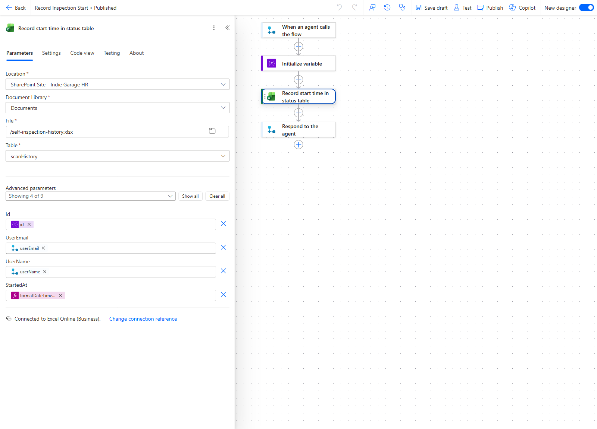
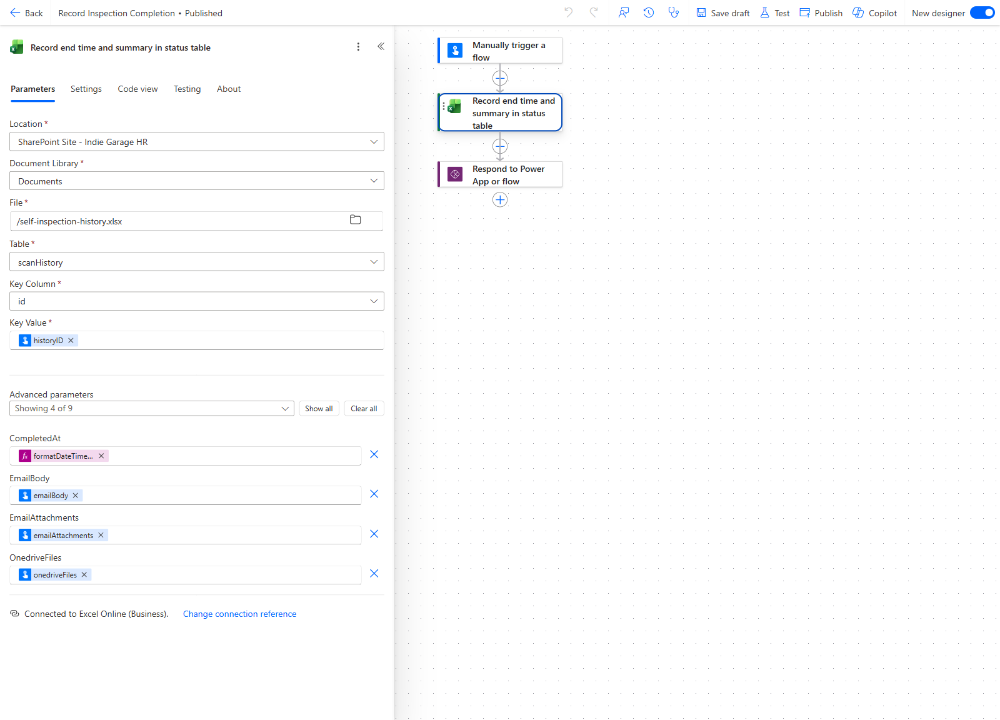

# Setup Guide — Compliance Self-Inspection Agent

**Scenario**: Employee-initiated compliance self-inspection of personal OneDrive documents and Outlook mail

**Platform**: Microsoft Copilot Studio + Power Platform (Power Automate, Dataverse, SharePoint, Excel Online, OneDrive, Outlook)

**Target Readers**: Solution Architect / Delivery Engineer / Power Platform Administrator / Copilot Studio Maker / Legal program owner

**Estimated Effort**: Intermediate — solution import and configuration, plus a governance decision workshop with Legal and IT

**Outcome:** An authorized employee can run a self-inspection against their own Outlook mail and OneDrive files, receive result links, and leave completion metadata in the compliance team's history workbook.

**Who is needed:** A SharePoint owner, a Power Platform administrator, an agent maker, and an ordinary employee for testing.

Follow Steps 1–7 in order. Complete governance and connection settings before using employee data.

## Resources

All deployment files and samples are in [0.Resources](0.Resources).

| Resource | Use |
|---|---|
| [Solution ZIP](0.Resources/ComplianceSelfInspectionAgent_1_0_0_5.zip) | Import into the Production environment |
| [self-inspection-result-template.xlsx](0.Resources/self-inspection-result-template.xlsx) | Upload to the private SharePoint site; copied to each employee's OneDrive |
| [self-inspection-history.xlsx](0.Resources/self-inspection-history.xlsx) | Upload to the same site; stores execution history |
| [Outlook_samples](0.Resources/Outlook_samples) | Four email attachments: DOCX, PPTX, XLSX, PDF |
| [OneDrive_samples](0.Resources/OneDrive_samples) | Four files to upload to the test user's OneDrive |
| [expected_scores.csv](0.Resources/expected_scores.csv) | Open in Excel to compare keywords, category counts, and numeric scores |

### Workbook structure

| Workbook | Sheet / table | Contents |
|---|---|---|
| Result template | `Sheet1` / `Table1` | `id`, `document`, `documentType`, 15 category-count columns, `riskScore`, `sourceURL` |
| History | `Sheet1` / `scanHistory` | `id`, `userEmail`, `userName`, `startedAt`, `completedAt`, `emailBody`, `emailAttachments`, `onedriveFiles` |

The result template calculates **numeric scores only**: High keyword count × 3, Medium × 2, Low × 1, across all five categories. Preserve its formula row: `A2` numbers result rows and `S2` calculates `riskScore`. The history workbook has an empty data row ready for use.

The two sample XLSX files contain a `Sample` sheet with four observations each. They are test documents, not deployment templates.

## 1. Prepare SharePoint and OneDrive

**Owner: SharePoint owner / maker**

1. In SharePoint, select **Create site → Team site → Private**. Add the compliance owners and the account that will provide the shared flow connections. Do not add all employees.
2. In **Documents → Upload → Files**, upload **`self-inspection-result-template.xlsx`** and **`self-inspection-history.xlsx`** from `0.Resources`. Keep these filenames and the existing Excel tables.
3. Open each workbook and confirm the table names above. Preserve the result template's formula row, then save and close the files.
4. Confirm the shared connection account can read the template and edit the history workbook. An ordinary employee should not be able to browse this site.
5. Choose an output-folder path, such as `/Self-Inspection Results`, inside each employee's OneDrive. Creating this folder manually is optional: if it does not exist, **Copy Self-Inspection Result Template** creates it automatically when the agent runs.

Record these values for import:

| Setting | Example |
|---|---|
| SharePoint site URL | `https://contoso.sharepoint.com/sites/Compliance` |
| Template path relative to that site | `/Shared Documents/self-inspection-result-template.xlsx` |
| Folder inside each employee's OneDrive | `/Self-Inspection Results` |

Use the library's actual URL segment: the library displayed as **Documents** commonly uses `Shared Documents`. Do not use a sharing link or an `AllItems.aspx` URL.

## 2. Create a Production environment

**Owner: Power Platform administrator**

1. Open [Power Platform admin center](https://admin.powerplatform.microsoft.com) → **Manage → Environments → New**.
2. Enter a name such as `Compliance-Production`, choose the appropriate region, set **Type = Production**, and enable **Dataverse**. Complete the database settings and select **Save**.
3. Assign the approved Microsoft Entra security group and limit maker/admin access to maintainers. Wait until the environment is ready.
4. Confirm Copilot Studio, the required AI Builder models, and connector entitlements are available. Pilot users need working Exchange Online mailboxes and provisioned OneDrive storage.
5. Review effective data policies. Allow the six connector families below together in the approved Business group; restrict unnecessary connectors and HTTP endpoints where supported.

Required connectors: **SharePoint**, **Excel Online (Business)**, **OneDrive for Business**, **Office 365 Outlook**, **Microsoft Dataverse**, **HTTP with Microsoft Entra ID (preauthorized)**.

**Licensing:** This agent is designed for authenticated employee use covered by the **Microsoft 365 Copilot User Subscription License (USL)**. For licensed users running the agent in that included-use context, additional Copilot Credits are not required. Users without Microsoft 365 Copilot USL consume Copilot Credits. Included agent-flow usage requires the **When an agent calls the flow** trigger and the licensed user's identity, subject to fair-use limits; do not assume the same coverage for independently triggered flows. See [Microsoft's billing guidance](https://learn.microsoft.com/microsoft-copilot-studio/requirements-messages-management).

## 3. Import the solution

**Owner: Maker / deployment administrator**

1. Open [Power Apps](https://make.powerapps.com), select the **Production environment** created in Step 2, then **Solutions → Import solution → Browse**.
2. Select `0.Resources\ComplianceSelfInspectionAgent_1_0_0_5.zip`. Confirm `ComplianceSelfInspectionAgent`, version `1.0.0.5`. The supplied package is **Unmanaged**, which allows the history-flow configuration in Step 4.
3. Map connection references to valid target-environment connections. Use the approved SharePoint/history connection account for shared storage.
4. For **HTTP with Microsoft Entra ID (preauthorized)**, use `https://graph.microsoft.com` for both **Base Resource URL** and **Microsoft Entra ID Resource URI** in the commercial cloud. Sign in.
5. Enter the three environment variables below, then select **Import**.
6. Confirm the solution contains the agent, `Self-Inspection` topic, five flows, five prompts, six connection references, and three environment variables.

| Environment variable | Schema name | Example input |
|---|---|---|
| Self-Inspection SharePoint Site URL | `dv_SelfInspectionSharePointSiteUrl` | `https://contoso.sharepoint.com/sites/Compliance` |
| Self-Inspection Template Path | `dv_SelfInspectionTemplatePath` | `/Shared Documents/self-inspection-result-template.xlsx` |
| Self-Inspection Output Folder | `dv_SelfInspectionOutputFolder` | `/Self-Inspection Results` |

Enter plain text, without quotes or URL-encoding. On an update, review any prefilled target values.

**Why this split?** URLs and file/folder paths are easy to identify and enter, so they are environment variables. File, drive, and table IDs are harder to discover, so some flows will use **designer dropdowns** instead.

## 4. Configure Record Inspection Start and Record Inspection Completion

**Owner: Maker**

Only these two flows need manual workbook selection. Runtime connection settings for the flows are covered in Step 5.

### Record Inspection Start

1. In the solution, open **Record Inspection Start → Edit** and select **Record start time in status table**.
2. Use the dropdowns to select your SharePoint **Location**, **Document Library**, **File = self-inspection-history.xlsx**, and **Table = scanHistory**.
3. Expand **Advanced parameters** and set the fields below. Selecting a different file/table can clear these mappings.
4. Save the flow; in a designer with **Save draft / Publish**, publish the saved changes.

| Field | Value |
|---|---|
| `id` | Variable `id` |
| `userEmail` | Trigger input `userEmail` |
| `userName` | Trigger input `userName` |
| `startedAt` | Timestamp expression below |

**Configured example — Record Inspection Start**



### Record Inspection Completion

1. Open **Record Inspection Completion → Edit** and select **Record end time and summary in status table**.
2. Select the same SharePoint **Location**, **Document Library**, **File = self-inspection-history.xlsx**, and **Table = scanHistory**.
3. Set **Key Column = id**, **Key Value = historyID** from the trigger, and the advanced fields below.
4. Save the flow; publish the saved changes if required by the designer.

| Field | Value |
|---|---|
| `completedAt` | Timestamp expression below |
| `emailBody` | Trigger input `emailBody` |
| `emailAttachments` | Trigger input `emailAttachments` |
| `onedriveFiles` | Trigger input `onedriveFiles` |

**Configured example — Record Inspection Completion**



The screenshots show the English designer with an example site's saved configuration. Select your own SharePoint site; its display name may use a different language.

**Timestamp expression for `startedAt` and `completedAt`:**

```text
formatDateTime(addHours(utcNow(), 9), 'yyyy-MM-dd HH:mm:ss')
```

The solution is set to **Korea Standard Time (KST, UTC+9)**. If your organization uses another time zone, update both history expressions, the topic's date conversion, and the result filename timestamp consistently.

## 5. Apply governance and runtime permissions

Complete **administrator tasks first**, then maker tasks. These are required for production, not optional cleanup.

### Administrator tasks

1. In [Power Platform admin center](https://admin.powerplatform.microsoft.com), select the environment → **Settings → Users + permissions → Security roles**.
2. Copy **Basic User** and **Environment Maker** into dedicated roles, such as `Self-Inspection User` and `Self-Inspection Maker`. Do not edit the built-in roles.
3. In **both copies**, find **AI Event** (`msdyn_aievent`) and set **Create**, **Read**, and **Write** to **None**. Save.
4. Assign the maker both custom roles and **Delegate**. Assign ordinary employees the custom Basic User-based role and only the additional minimum permissions they need.
5. Review direct and team-inherited roles: privileges are cumulative. Another role can grant AI Event access even when the custom role says None.
6. Open **Settings → Product → Features → Cloud flow run history in Dataverse**. Set **FlowRun entity time to live → Disabled**, then save.
7. Approve audit scope, retention, owner succession, and access-review responsibilities with the compliance owner.

**Separate controls:** Disabling FlowRun stops new Dataverse run-metadata ingestion; it does not erase existing records or mask standard Power Automate action history. AI Event permissions and secure inputs/outputs address different data stores.

### Maker tasks

1. In **AI hub → Prompts** or the prompt list in Copilot Studio, share all five prompts below with the pilot users/team using **use/run** access.
2. Open each flow's **Run-only users → Edit → Connections used** (or its connection-management panel) and apply the identity matrix below.
3. In action **Settings**, enable supported **Secure inputs / Secure outputs** for document bytes, mail bodies, attachments, prompt data, and result rows. Include downstream actions that carry the same content.
4. Keep results private to the employee. Restrict flow co-owners, administrators, and transcript access; apply the agreed retention policy.

| Prompt | Model |
|---|---|
| Compliance Keyword Analysis | GPT-4.1 mini |
| Extract Text from DOCX | GPT-5 chat |
| Extract Text from XLSX | GPT-5 chat |
| Extract Text from PPTX | GPT-5 chat |
| Extract Text from PDF | GPT-5 chat |

| Flow / connection use | Required runtime identity |
|---|---|
| Template copy: SharePoint | Approved shared connection account |
| Template copy: OneDrive | Provided by run-only user |
| Both scan flows: Graph HTTP, Excel result access, Outlook, and OneDrive where used | Provided by run-only user |
| Both scan flows: Dataverse prompts | **Provided by run-only user**, after roles and prompt sharing are ready |
| Start and completion history flows: Excel | Approved shared connection account; completion child-flow connections stay embedded |

**Required change after import:** Both scan flows are packaged with maker-provided Dataverse connections. Change them explicitly to user-provided connections. Inspect Excel identity per flow: history access is shared, result access is personal.

The flows are invoked inside the topic. Do not add duplicate agent tools. Sharing the agent does not replace prompt sharing, role assignment, or connector consent.

## 6. Enable, publish, and share

**Owner: Maker / channel administrator**

1. Resolve flow connection errors, then turn on these flows: **Record Inspection Completion**, **Record Inspection Start**, **Copy Self-Inspection Result Template**, **Scan Emails and Attachments**, **Scan OneDrive Files**.
2. Open **Copilot Studio → Compliance Self-Inspection Agent → Topics → Self-Inspection**. Confirm flow nodes resolve and the date card, condition, and warning agree on **1–180 days inclusive**.
3. Confirm prompt references match the five prompts above. Save intentional changes and resolve checker errors.
4. Select **Publish** and wait for a success status. A successful solution import is not a channel publication.
5. Open **Channels → Teams and Microsoft 365 Copilot**, configure the channel, and grant the pilot group chat/use access.
6. Have the channel administrator approve/install the agent where tenant policy requires it. Each pilot user signs in and consents to the expected connectors with their own account.

**Before rollout:** Test once as the maker and once as an ordinary employee. Do not use an administrator-only test to approve user permissions.

## 7. Run UAT with the supplied samples

### Prepare and run

1. Choose a test day **D**. From `0.Resources\Outlook_samples`, attach `Outlook_vendor_due_diligence.docx`, `Outlook_gifts_hospitality_review.pptx`, `Outlook_conflict_of_interest_register.xlsx`, and `Outlook_trading_window_incident.pdf` to an email to the test user. Use subject **Sample documents** and body **Please review the attached files.**
2. From `0.Resources\OneDrive_samples`, upload `OneDrive_expense_audit_summary.docx`, `OneDrive_third_party_risk_briefing.pptx`, `OneDrive_hospitality_log.xlsx`, and `OneDrive_quarterly_compliance_digest.pdf` to that user's OneDrive. Ensure each sample appears once in its intended channel.
3. Keep `expected_scores.csv` and this runbook outside the scanned content set. They repeat keywords and must not be test inputs.
4. Select a range covering mail **receivedDateTime** and OneDrive **lastModifiedDateTime**. For cleaner isolation, run D-to-D the following day; same-day scans can include generated result files.
5. In a new agent conversation, enter **Start self-inspection**, select the dates, and submit.
6. Wait for **both scan runs to succeed and both completion emails**. The chat's “started” message is not completion.
7. Open the result workbook and `expected_scores.csv`. Compare by filename, then repeat through the published channel as an ordinary employee.

### Expected results

Each keyword phrase appears once and counts as one hit, regardless of the number of words in the phrase. Samples have **2–5 hits per file**, **27 total**: Outlook 14, OneDrive 13.

| Sample | Hits | `riskScore` |
|---|---:|---:|
| Outlook_vendor_due_diligence.docx | 2 | 2 |
| Outlook_gifts_hospitality_review.pptx | 3 | 6 |
| Outlook_conflict_of_interest_register.xlsx | 4 | 7 |
| Outlook_trading_window_incident.pdf | 5 | 10 |
| OneDrive_expense_audit_summary.docx | 2 | 2 |
| OneDrive_third_party_risk_briefing.pptx | 2 | 3 |
| OneDrive_hospitality_log.xlsx | 4 | 9 |
| OneDrive_quarterly_compliance_digest.pdf | 5 | 5 |

Use the CSV's `keywords` and `totalMatches` to review the planted matches, then compare its 15 `cat*` fields and `riskScore` with the result workbook.

### Pass checklist

| Check | Pass condition |
|---|---|
| Result file | A workbook appears in the invoking user's output folder, named `<timestamp>_self-inspection-result_<start>_<end>.xlsx` |
| Keyword counts | Every sample's 15 category counts match the CSV; their sum equals its expected hits |
| Score | `riskScore` matches the table above; formula cells contain no errors |
| Result links | `sourceURL` identifies the corresponding source; completion email opens the result workbook |
| History | One `scanHistory` row has the user's identity and GUID; completion updates the same row and final counts reconcile |
| Completion | Both scan flows succeed and both emails arrive; a populated `completedAt` alone is insufficient |
| Isolation | User B cannot open user A's results; ordinary users cannot browse the private compliance site |
| Governance | Restricted user prompt calls succeed, new AI Event content is not persisted, and sensitive action data is masked |

Additional mail-body rows and other in-range files can change overall row counts. Reconcile them separately from the eight sample documents. The samples contain text; image-only/scanned content is outside this test's scope.

## Optional: Customize detected keywords

Skip this section to use the supplied keyword lists. Obtain compliance-owner approval and test changes in a separate development/test environment or a copy of the prompt before applying them to production.

1. Open **AI hub → Prompts** (or the prompt list in Copilot Studio **Tools**) and select **Compliance Keyword Analysis**. Use a copy for testing; leave the four text-extraction prompts unchanged.
2. In the prompt editor, locate **`RULES`**. Keywords are grouped under `cat1`–`cat5`, each with `high`, `medium`, and `low` lists.
3. Add, edit, or remove a quoted keyword in the appropriate list. Preserve the dictionary structure, the `inputText` input, and all 15 output keys.
4. Enter sample text in **`inputText`** and select **Test**. Include the edited keyword, repeated occurrences, and a no-match case.
5. Open **Code** and confirm its `RULES` dictionary contains the edits. Return to the response view and confirm all 15 numeric counts, including zeros, match your expectations.
6. Select **Save**. After approval, apply the tested changes to the **Compliance Keyword Analysis** prompt used by the solution and repeat the test. Saving a separate copy alone does not update the flows.
7. Deploy through your approved change process, publish the agent, and repeat the Outlook and OneDrive tests in Step 7. Update affected samples, `expected_scores.csv`, and the expected-results table in this guide.

**Example:** To detect `event ticket` as a medium-severity gifts/hospitality keyword, add it to the existing `cat2` medium list:

```json
"medium": ["golf outing", "gift card", "event ticket"]
```

Test with `event ticket event ticket business meal`. Expect `cat2_medium = 2`, `cat2_low = 1`, and all other counts `0`. The corresponding weighted `riskScore` is **5**. Matching is case-insensitive and counts occurrences, not just unique keywords.

Editing words within existing lists does not require new workbook columns. **Adding, deleting, or renaming categories** requires coordinated changes to the prompt output, both scan flows, the result-template columns and score formula, and expected test results.

## Operational handover

1. Record owners, retention, connection renewal, and rollback procedures. Restrict editing of the imported solution to approved maintainers.
2. Stagger larger campaigns to reduce Excel locking and connector throttling.
3. If your organization requires **Managed** deployments, prepare a managed release through its approved application lifecycle process. Configure target-specific history bindings before export when production policy prevents designer changes.

## Troubleshooting

| Problem | Action |
|---|---|
| Unexpected credit/billing message | Check the invoking user's Microsoft 365 Copilot USL and authenticated agent invocation. For users without USL, arrange Copilot Credit billing. |
| Flow off after import | Repair connections and turn on the five required flows |
| Template not found | Check site URL, plain template path, library segment, and shared account access |
| History write fails | Re-select workbook/table in both history flows and restore advanced mappings |
| Prompts fail for employees | Check all five prompt shares, effective roles, Delegate assignment, and user-provided Dataverse connections |
| Graph requests fail | Check the preauthorized HTTP connector, Graph resource/base URL, user access, and DLP |
| Publish disabled | Resolve portal/environment errors; do not treat import as publication |
| Missing or extra samples | Check received/modified dates, duplicate copies, pagination, and other in-range files |
| Wrong user's results | Stop; correct the scan and output connections to run-only user |
| History counts disagree | Wait for both scans, inspect workbook contention, and reconcile final result rows |

## References

[Architecture](2.Architecture.md) · [Environment variables](https://learn.microsoft.com/power-apps/maker/data-platform/environmentvariables) · [Security roles](https://learn.microsoft.com/power-platform/admin/security-roles-privileges) · [AI Builder activity](https://learn.microsoft.com/ai-builder/activity-monitoring) · [FlowRun settings](https://learn.microsoft.com/power-automate/dataverse/cloud-flow-run-metadata) · [Publish and deploy](https://learn.microsoft.com/microsoft-copilot-studio/publication-fundamentals-publish-channels)
