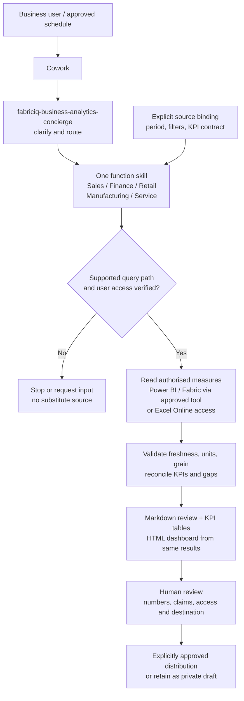

# Recurring Analytics Cowork Agent - Architecture

## Data-to-Review Flow

This is six skills inside Cowork, not a custom analytics backend or six independently hosted
agents. No new ingestion/index/store or model is built in the default engagement. Actual
Copilot processing, conversation retention and generated artifact handling still require review.

## Components

| Component | Responsibility | Important boundary |
|---|---|---|
| Cowork session | Discover skills, route intent and prepare outputs | New session after package changes; prove required tools are callable |
| Concierge | Function, period, region/segment and source clarification | Never invent KPIs or execute all function reviews |
| Function skill | Consolidated review with consistent subreports | Domain measures must exist in the approved source |
| Fabric IQ plugin path | Source-material integration route for Power BI/Fabric | Availability and query permissions are tenant qualification gates, not assumed |
| Excel Online workbook path | Alternative existing-data source | Prove table/range retrieval and correct access; not merely a readable URL |
| Existing source/model | Measures, business logic, freshness and RLS | No hidden formula changes or identity substitution |
| Approved references | KPI definitions, period rules, thresholds, persona and output contract | No embedded credentials or permanently hardcoded report URL in skill instructions |
| Draft artifacts | Narrative, tables and HTML dashboard | Static copies need their own access and sensitivity review |

## Per-Run Data Contract

Record source URL/identity, model/report/workbook version where available, query identity,
refresh time and review as-of; reporting and comparison periods; fiscal calendar/timezone;
region/segment and other filters; aggregation grain; units/currency; authoritative measures,
denominators and thresholds. Record unavailable metadata rather than guessing.

For schedules, store an approved source reference in the schedule configuration only when
supported. Revalidate on source/identity changes. If the package's interactive-URL contract
cannot be satisfied by an approved scheduled binding, keep the workflow on demand.

## Numerical and Narrative Contract

1. Retrieve governed measures under the user's actual permissions.
2. Validate the reporting window and comparable prior/budget/plan values.
3. Reconcile sampled values against the source at the same refresh and filters.
4. Use approved derived arithmetic only, with stated formula and rounding.
5. Generate all output forms from the **same validated result set**.
6. Explain supported changes; label hypotheses and missing driver evidence.

Do not sum ratios, mix currencies or compare partial periods without explicit approval.
Zero and missing denominators require separate treatment. An unavailable quota does not imply
zero attainment. Absent stockout/escape-risk definitions do not justify inventing risk scores.

## Output Structure

- Header: function/persona, source link, as-of/refresh, periods, filters, units, limitations.
- Executive summary: key changes and material risks, supported by evidence.
- KPI and variance tables: current, comparison, approved absolute/percentage change, status.
- Consolidated function subreports: the relevant measures listed in the overview.
- Proposed actions: evidence, reason, priority, and confirmed owner/date or explicit gaps.
- HTML dashboard: matching values/periods, readable tables and text risk labels alongside
  colour; no external publishing or unsupported claim of a production dashboard.

An empty/failed source produces an explicit blocked/incomplete review, not a success-shaped
dashboard with zeros. Refresh, query, permission and policy errors remain visible.

## Security, Recurrence and Operations

Test distinct RLS personas, including a denied user. Query-time RLS protects retrieval, not
every later copy of an output. Do not share one persona's report with another unless its
contents and destination are authorised. Finance is confidential by default.

The last complete Monday-Sunday week is the default for both on-demand and scheduled runs.
Review calendar boundaries and daylight saving; monthly/quarterly variants need their own
tests. Scheduled preparation never supplies blanket approval for distribution.

Maintain prompt/package versions, schedule ownership, access reviews, usage and failure
records with minimal sensitive content. Pause recurrence on unresolved source or quality
failures; rollback to an approved version and retest in a new session.

See [Governed Analytics Review](../../02-patterns/Governed-Analytics-Review/Governed-Analytics-Review.md)
for reusable data validation and [the scenario runbook](3.Runbook.md) for acceptance.
