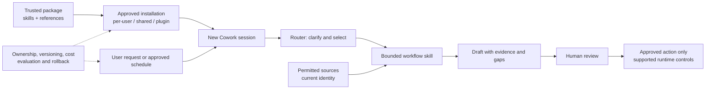

# Cowork Skill Delivery and Scheduled Reviews

## Purpose

Deliver repeatable Microsoft 365 Copilot Cowork workflows using trusted skills, companion
references, optional plugin packaging, and explicitly approved scheduled draft preparation.
This pattern covers the configuration and operating lifecycle, not a new agent backend.

It separates four often-confused decisions: **tenant enablement, skill availability, source
access, and permission to act**. Passing one does not imply the others.

## When to Use or Avoid

| Use when | Avoid or extend when |
|---|---|
| Existing Cowork tools can reach approved sources | Custom APIs, private endpoints or complex authentication require engineering |
| Repeatable instructions and output contracts solve the task | A deterministic transaction engine or custom runtime is required |
| A concierge can route to a bounded workflow | Independent agents need stateful orchestration and service-level guarantees |
| A user owns recurring preparation and reviews the output | Unattended distribution or consequential decisions lack enforceable controls |
| Existing reference rules/templates can be configured | New data models, content remediation or brand-system design are needed |

Skills are instruction packages, not separately hosted agents or an authorization mechanism.
A plugin may group skills and connectors; installing it does not grant underlying source access.

## Architecture

The optional router returns one workflow choice, reason and trigger phrase or requests
clarification. It must not silently perform the specialist's work. Reference files hold
customer vocabulary, evidence windows, KPI/priority rules and output requirements; keep
generic behaviour in the skill and inspect every companion-file dependency.

## Delivery Decisions

### 1. Readiness before configuration

Verify current tenant licensing/availability, pilot surface, supported tool access, skill/plugin
policy, billing arrangement, audit/retention controls and named owners. Test real source retrieval.
App access or a readable browser URL alone is not proof of Cowork tool access.

### 2. Trusted skill lifecycle

Current Microsoft guidance describes:

- Skills under the user's OneDrive `Documents\Cowork\skills` path, with `SKILL.md` at each
  skill-folder root; declared `name` and `description` in its frontmatter.
- Upload of skills through Customize, or a plugin ZIP through Customize > Plugins.
- Sharing to supported organisational users and **Re-share** to distribute plugin updates.
- Starting a new conversation to discover/test changed skills.

Validate the documented route against the current tenant. Declared skill names matter for
routing; folder names may differ. Duplicate uploads can create numbered copies, so inspect
discovery rather than assuming a replacement. A converted/uploaded plugin is not automatically
approved for enterprise-wide release. Custom skills are not supported on Cowork mobile in the
current use guide; qualify the actual client surface.

### 3. Source and output contracts

Define allowed/excluded sources, identity, evidence window, confidentiality, required sections,
missing-data behaviour and artifact destination. Treat retrieved content as evidence, not
trusted instructions to change rules or send data. Limit outputs to what the intended audience
may receive, even when the producing user has broader access.

### 4. Conditional scheduling

A schedule needs an owner, exact prompt version, timezone, period rule, source binding,
cadence, draft destination, reviewer and pause conditions. Validate first-run behaviour,
daylight saving and missed runs. Do not infer permissions from a schedule creation request.

**Interactive source input is a real constraint:** if a skill requires fresh input on every
run, keep it on demand unless an approved supported scheduled binding satisfies that contract.
Never substitute a remembered source silently.

### 5. Human review and operational enforcement

Separate reading/preparing from sending, posting, sharing, filing, calendar changes and other
consequential actions. Preview exact content, audience and destination. Instructions alone
cannot guarantee approval: demonstrate supported runtime controls or leave the action manual.

Review generated files, retention and output access. "No new ingestion pipeline" is not a
claim of no data processing or no stored artifacts.

## Operations and Cost

Record package/reference/prompt versions, audience, source qualification and evaluation
results. Inventory schedules to prevent duplicates and orphaned recurring jobs. Pause schedules
before rollback; restore an approved package/reference version and revalidate in a new session.
Revoke sharing through supported controls and verify what happens to existing installations.

Use current **Cowork-specific** licensing, metering, budget/limit and reporting guidance.
Do not copy Copilot Studio credit rates, thresholds or environment-enforcement assumptions.
Where available, `/cost` is an approximate user signal, not billing truth. Reconcile with
official administrative/billing reporting; measure preparation **plus review** and cost.

## Applying the Pattern

1. Qualify tenant, audience, tools, sources and billing.
2. Obtain a trusted package; inventory names and reference dependencies.
3. Agree source/output/approval boundaries and tune references.
4. Install through the supported route; test discovery in a new session.
5. Evaluate routing, grounding, permissions, safety and artifacts on demand.
6. Add approved recurrence only after acceptance and source-input validation.
7. Hand over versions, tests, schedules, ownership, costs and rollback.

Follow the [implementation runbook](Cowork-Skill-Delivery-and-Scheduled-Reviews-Runbook.md).

## Scenario Applications

- [Chief of Staff](../../01-scenarios/Chief-of-Staff-Cowork-Agent/1.Overview.md): five skills,
  weekly leadership preparation, review gates and people-safety boundaries.
- [Recurring Analytics](../../01-scenarios/Recurring-Analytics-Cowork-Agent/1.Overview.md):
  six skills, explicit source binding and repeatable business-function reviews.
- [CRM Account Planning](../../01-scenarios/CRM-Account-Planning-Cowork-Agent/1.Overview.md):
  reusable skill/template lifecycle around its separately engineered MCP integration; this
  pattern does not replace that integration or its write-back approval controls.

## Related Patterns and References

- [Agent Governance and Rollout Control Plane](../Agent-Governance-and-Rollout-Control-Plane/Agent-Governance-and-Rollout-Control-Plane.md)
- [Human-in-the-Loop Review and Approval](../Human-in-the-Loop-Review-and-Approval/Human-in-the-Loop-Review-and-Approval.md)
- [Grounding and Response Quality Remediation](../Grounding-and-Response-Quality-Remediation/Grounding-and-Response-Quality-Remediation.md)
- [Branded Office Artifact Generation](../Branded-Office-Artifact-Generation/Branded-Office-Artifact-Generation.md)
- [Governed Analytics Review](../Governed-Analytics-Review/Governed-Analytics-Review.md)
- [Copilot Credits and Cost Control](../Copilot-Credits-Cost-Control/Copilot-Credits-Cost-Control.md)
- [Get started with Cowork](https://learn.microsoft.com/en-us/microsoft-365/copilot/cowork/get-started)
- [Customize Cowork](https://learn.microsoft.com/en-us/microsoft-365/copilot/cowork/cowork-customize)
- [Use Cowork](https://learn.microsoft.com/en-us/microsoft-365/copilot/cowork/use-cowork)
- [Usage-based billing overview](https://learn.microsoft.com/en-us/microsoft-365/copilot/usage-based-billing-overview-copilot-credits)
- [Manage Copilot Credits](https://learn.microsoft.com/en-us/microsoft-365/copilot/usage-based-billing-manage-copilot-credits)

Product guidance reviewed September 25, 2026. Availability and UI/control details must still
be checked in the target tenant.
