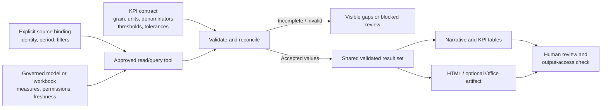

# Governed Analytics Review

## Purpose

Turn existing governed business data into repeatable, source-backed reviews without creating
new business logic in an LLM response. Bind an exact source and reporting contract, retrieve
authoritative measures under the user's permissions, reconcile values, then generate a narrative,
tables and optional dashboard/artifacts from the same validated results.

This pattern complements grounding: a citation alone does not prove that the **number, period,
filter, denominator or comparison** is correct.

## When to Use or Avoid

| Use when | Avoid or separately scope when |
|---|---|
| Existing reports/models/workbooks have authoritative measures | Data engineering, ETL or semantic-model repair is required |
| Reviews repeat across periods and functions | Users want an unsupported source or bypass of source permissions |
| Data owners can validate expected values and definitions | There is no agreed KPI meaning, grain or comparison baseline |
| Outputs are reviewed before decisions/distribution | Real-time autonomous actions or regulatory advice are expected |

The base implementation uses existing Power BI/Fabric or Excel Online data. Other systems
need separately qualified access and governance; the pattern is not a generic connector.

## Architecture

The "validated result set" can be an in-session reviewed table; this diagram does not prescribe
a new database. Retain only approved evidence needed for review and audit.

## Source and KPI Contract

| Dimension | Required definition |
|---|---|
| Source | Exact approved URL/identity; report/model/workbook and relevant tables/measures |
| Access | Query identity, permitted scope and RLS persona |
| Time | Reporting/comparison windows, timezone/fiscal calendar, refresh/as-of and freshness limit |
| Slice | Region/segment and other filters; aggregation grain |
| Units | Currency, conversion basis if approved, measurement units and rounding |
| Measures | Authoritative definitions, denominators, quota/budget/plan and comparison baselines |
| Risk | Materiality/variance thresholds and explicit unknown state |
| Acceptance | Source-owner-approved tolerances, sample values and output audience |

Do not silently reuse a previous source or guess a URL. For schedules, explicitly approve the
binding and prove the execution identity can query it. An interactive-only source contract
may prevent unattended preparation.

## Numerical Integrity

- Prefer source-defined measures. An LLM must not redefine "revenue", "margin", "yield", or
  "SLA attainment" because a convenient calculation is available.
- Any derived calculation needs an approved formula, inputs and rounding trace.
- Do not sum percentages, average ratios without weights, mix grain/currencies, or compare
  partial and complete periods without explicit approved treatment.
- Missing is not zero. A zero denominator is different from an unavailable denominator.
  Show an undefined percentage as such; use absolute change only when valid.
- Reconcile each representation to the same values. Formatting or HTML generation must not
  trigger independent, inconsistent calculations.
- Name stale refreshes and partial/truncated query results. Do not imply completeness if tool
  limits prevent full retrieval; narrow the approved scope or stop.

## Explanations and Decisions

Separate:

1. **Observed change:** the validated KPI difference.
2. **Supported contribution:** a source-supported breakdown by approved dimension.
3. **Hypothesis:** a possible explanation not established by the available evidence.
4. **Proposed next step:** an action for review, not an automatically executed decision.

A segment contributing most of a decline does not prove its cause. Do not invent causal
drivers, owners, dates, forecasts or risk scores. Employee ranking, productivity/working-hours
analysis and wellbeing inference are not acceptable substitutions for business analytics.

## Output and Distribution Contract

Include source, refresh/as-of, periods, filters, units, KPI/variance tables, supported narrative,
risks, proposed actions and explicit gaps. A dashboard must match the tables and include text
risk labels rather than relying on colour alone.

Generated HTML is an artifact, not a production portal. Review it for unexpected external
requests, embedded data beyond the approved scope, credentials and unsafe content. Apply
approved hosting/security requirements separately if publication is requested.

RLS constrains source queries, but copied files do not automatically reapply live source RLS.
Review the output's permitted audience, classification and destination separately. Treat finance
as confidential by default where required by the scenario. Retain human approval before sharing,
write-back or other consequential actions.

## How to Apply

1. Qualify the actual query path and source owner.
2. Agree the source/KPI contract and baseline effort.
3. Test known values, denied access and RLS personas.
4. Generate reviews from reconciled data; surface missing/stale/partial data.
5. Validate narrative/table/dashboard consistency and claims.
6. Review output access and approve any distribution.
7. Revalidate on source/model/period/permission changes; monitor quality, cost and value.

Follow the [implementation runbook](Governed-Analytics-Review-Runbook.md).

## Scenario Applications

- [Recurring Analytics](../../01-scenarios/Recurring-Analytics-Cowork-Agent/1.Overview.md):
  primary pattern for Sales, Finance, Retail, Manufacturing and Service reviews.
- [Chief of Staff](../../01-scenarios/Chief-of-Staff-Cowork-Agent/1.Overview.md):
  conditional application when a leadership pack includes approved governed metrics.
- [CRM Account Planning](../../01-scenarios/CRM-Account-Planning-Cowork-Agent/1.Overview.md):
  pipeline/QBR reconciliation after its separate CRM integration is qualified.

## Related Guidance

- [Cowork Skill Delivery and Scheduled Reviews](../Cowork-Skill-Delivery-and-Scheduled-Reviews/Cowork-Skill-Delivery-and-Scheduled-Reviews.md)
- [Grounding and Response Quality Remediation](../Grounding-and-Response-Quality-Remediation/Grounding-and-Response-Quality-Remediation.md)
- [Human-in-the-Loop Review and Approval](../Human-in-the-Loop-Review-and-Approval/Human-in-the-Loop-Review-and-Approval.md)
- [Branded Office Artifact Generation](../Branded-Office-Artifact-Generation/Branded-Office-Artifact-Generation.md)
- [Power BI row-level security](https://learn.microsoft.com/en-us/fabric/security/service-admin-row-level-security)
- [Power BI sensitivity labels](https://learn.microsoft.com/en-us/fabric/enterprise/powerbi/service-security-sensitivity-label-overview)

The source-material Cowork/Fabric IQ integration route must be verified in the target tenant;
this pattern does not assert universal tool availability or automatic artifact protection.
