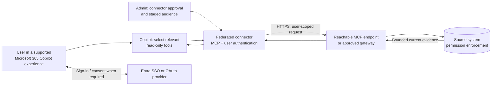
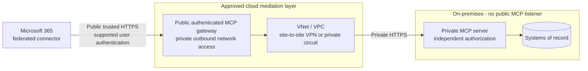

# MCP Federated Connectors Pattern

> **Live, read-only external knowledge for supported Microsoft 365 Copilot experiences,
> without building a Microsoft 365 index of the source content.** This is a distinct connector
> pattern, not a general-purpose MCP tool integration or a write-back architecture.

**Documentation baseline:** September 22, 2026. Based on the
[federated connectors overview](https://learn.microsoft.com/en-us/microsoft-365/copilot/connectors/federated-connectors-overview)
and [custom connector setup](https://learn.microsoft.com/en-us/microsoft-365/copilot/connectors/set-up-custom-federated-connectors).
Verify availability in the target tenant and experience before committing to delivery.

---

## Why This Pattern

| Signal | Fit |
|---|---|
| Business need | Ask about current external records, policies, project status, or research evidence alongside Microsoft 365 context |
| Freshness | Query the source at request time rather than wait for a crawl |
| Data architecture | Avoid maintaining an external-content index in Microsoft 365 |
| Permissions | Use each user's source-system identity and access rights |
| Control plane | Admin-governed connectors, staged audiences, user connection and consent |
| Typical applications | Account research, meeting briefings, employee knowledge lookup, legal research, project context |

**The two qualification gates are authentication and reachability.** An existing MCP server is
not automatically a usable federated connector. Complex enterprise authentication and
private-only on-premises MCP endpoints can still block this pattern.

---

## What It Is - and What It Is Not

| Approach | Data path | Use it for | Boundary |
|---|---|---|---|
| Synced Copilot connector | Crawl and index content with ACLs in Microsoft Graph | Broad search over relatively stable knowledge | Crawl freshness and permission-mapping work |
| **MCP federated connector** | Retrieve live through MCP in the user's source context | Read-only external research and record lookup | Supported Copilot experience, auth fit, and reachable endpoint required |
| Direct MCP plugin or agent tool | Host invokes tools you expose | Custom workflows, composed queries, and supported actions | Host-specific manifest, authentication, and runtime behaviour |
| Power Platform connector or custom orchestration | Explicit API/action execution | Transactions, approvals, scheduled workflows | Separate platform and operating model |

Federation is a way to consume an MCP server, not a replacement for designing and operating one.
A custom read-only `query` tool can compute a scoped result server-side; federation does not
itself make model-selected search exhaustive or supply a transactional workflow engine.

### Supported experiences

The overview currently lists **Microsoft 365 Copilot Chat, Copilot in Excel, Researcher, and
Cowork**. Test the specific connector in the intended experience, tenant, region, and licensed
user population. This list is not a promise that any custom declarative agent, Copilot Studio
agent, Foundry agent, or Microsoft Search surface can consume that connection.

### Two onboarding routes

- **Gallery connector:** Microsoft-published or partner-submitted and Microsoft-approved.
  Check the specific provider's scopes, available tools, regional offering, and admin approval.
- **Organisation-created connector:** register your compatible MCP endpoint and supported
  authentication through the custom federated connector setup. Custom federation is documented;
  it is not limited to the gallery. This does not automatically publish the connector for
  other tenants.

Gallery coverage changes. Do not assume a ServiceNow, Workday, or Salesforce integration is
available merely because another connector type supports that source.

---

## Architecture

1. The admin enables the connector for a controlled audience.
2. The user connects with the configured authentication method.
3. Copilot selects relevant read-only MCP tools at runtime.
4. The MCP service and source enforce the user's access and return scoped evidence.
5. Copilot uses the returned evidence to answer; verify citations and freshness in the host.

There is **no synced external-content index** in this path. That does not mean no data leaves
the source: selected content enters Copilot's processing path and may appear in responses.
Review applicable conversation retention, audit, residency, and compliance policies rather
than promising that "no indexing" means "no processing or retention."

---

## Authentication: Supported Basics, Complex Flows Still Need Proof

The [custom setup guide](https://learn.microsoft.com/en-us/microsoft-365/copilot/connectors/set-up-custom-federated-connectors)
documents these methods:

| Method | Documented configuration | What it does not establish |
|---|---|---|
| Microsoft Entra SSO | Entra app/API setup, required audience configuration, and an SSO registration ID from Teams Developer Portal | Arbitrary downstream OBO chains, cross-tenant arrangements, or source-system delegation |
| OAuth 2.0 | Provider app plus Teams Developer Portal OAuth registration; client ID/secret, authorization, token and refresh endpoints, scopes, optional PKCE | Support for every provider extension, custom token parameter, or interactive challenge |
| No Auth | No authentication registration | An acceptable bypass for protected enterprise data |

### The deficiency to highlight in qualification

**The connector configuration is not a general-purpose authentication broker.** The documented
setup offers predefined registration paths, not a place to run arbitrary auth hooks, exchange
multiple credentials, or adapt every enterprise authentication protocol.

The following are **compatibility gaps to resolve and test**, not a claim that every instance
of these flows is categorically unsupported:

| Complex requirement | Why the basic setup is insufficient evidence | Design response |
|---|---|---|
| Gateway token A, downstream token B, multiple audiences/scopes | Signing in proves neither the downstream exchange nor source authorization | Identify who validates/exchanges each token; prove delegation and source permissions end to end |
| Conditional Access, MFA/step-up, consent restrictions, external IdP | Initial login may work while refresh or later challenges fail | Test sign-in, refresh, expiry, revocation, consent denial, and policy challenges with real pilot users |
| Custom headers, provider-specific token parameters, API-key combinations, mTLS | These are not general configuration options documented for this connector setup | Obtain explicit support confirmation or implement an approved gateway adapter; do not promise wizard-only integration |
| Kerberos/NTLM, legacy sessions, service-account-only backend | An OAuth token at the front door does not create a user-scoped legacy identity | Engineer and review the mapping/delegation or choose another architecture; never silently widen access |
| Auth depending on a particular MCP revision or elicitation flow | Another MCP client working does not establish Copilot federation compatibility | Reconcile transport/protocol/auth behaviour in the actual federated connector host |

APIM, LiteLLM, or another gateway can perform approved validation, token exchange, and policy
enforcement. That is **additional software and configuration you own**, not a capability
automatically supplied by federation. LiteLLM's native Entra OBO in a Copilot Studio integration
does not prove the same connection works as a Microsoft 365 federated connector. Registration,
audience, permitted calling client, and user-session behaviour must be revalidated.

**No-go:** if required user-level authorization cannot be demonstrated, do not replace it with
an anonymous endpoint, maker credentials, or a shared privileged service identity.

---

## On-Premises MCP Servers Without Public Endpoints

### The connectivity deficiency

The cited federated connector setup documents an MCP base URL and authentication registration.
It does **not document a connector-side VNet attachment, private endpoint route, or an
on-premises relay for arbitrary MCP servers**. Treat a private-only MCP endpoint as blocked for
this path unless Microsoft confirms a supported alternative for the target tenant.

- A public DNS name resolving to a private IP is not cloud reachability.
- A VPN on the user's laptop does not connect the Microsoft-hosted connector runtime.
- An Azure VNet connected to on-premises through site-to-site VPN does not, on its own,
  connect Copilot SaaS to that VNet.
- The Graph connector agent used by supported **synced** connectors is not a federated MCP relay.
- Power Platform VNet integration and its on-premises data gateway belong to separate supported
  connector paths; they cannot be assumed to apply to Microsoft 365 federation.

### Conditional gateway-mediated design

This is an **architecture option requiring approval and a compatibility spike**, not documented
native private access for federated connectors. The gateway is publicly reachable but
authenticated; the MCP server and source can remain private.

Qualify both halves separately:

| Hop | Required evidence |
|---|---|
| Federated connector to gateway | Actual-host authentication, trusted TLS, MCP discovery and invocation, allowed audience/client, read-only tool exposure |
| Gateway to on-premises MCP | Private DNS, forward and return routes, narrow firewall rules, valid backend TLS, streaming, and source-user permission enforcement |
| Operations | Tunnel failure/recovery, latency, capacity, token isolation, credential rotation, safe error handling, and named owners |

If policy prohibits **any** public authenticated ingress, this design does not satisfy the
requirement. Choose supported synced ingestion if copying/indexing is permitted, or a separate
private-network-capable agent/application with explicitly supported connectivity. Neither is
the same federated experience. Do not expose the core system or disable TLS/authentication to
make the demo work.

For network implementation detail, use the separate
[MCP Server Integration hybrid topology](../MCP-Server-Integration/MCP-Server-Integration.md#on-premises-mcp-servers-through-an-azure-vnet-and-site-to-site-vpn).
Its VPN design addresses gateway-to-server reachability, not federated-host compatibility.

---

## Decision and Release Gates

| Gate | Proceed when | Stop or choose another path when |
|---|---|---|
| Retrieval vs action | Read-only knowledge or scoped record lookup is sufficient | Write-back, approval, provisioning, or autonomous execution is essential |
| Surface | The connector works in the intended supported Copilot experience | The design assumes every agent/channel inherits it |
| Provider/custom server | Required tools and fields are actually available | "It supports MCP" is the only evidence |
| Authentication | Real user sign-in, refresh, denial, and source authorization pass | Complex auth remains unresolved or access is broadened |
| Network | The connector reaches an approved authenticated endpoint | Only a private on-premises endpoint exists with no supported ingress path |
| Compliance | Live content processing and audit are approved | "No index" is being used as a substitute for data-flow approval |
| Quality and operation | Freshness, completeness bounds, citations, and latency are measured | Live retrieval is being presented as exhaustive analytics or an availability guarantee |

Never label a connector ready based only on registration, an HTTP health check, or a successful
desktop MCP-client call. Require signed-in discovery and tool invocation in the exact Copilot
experience, plus denied-access and cross-user tests.

---

## Where This Pattern Applies in This Repository

These are **applicability options**, not claims that the scenarios have been delivered using
federated connectors. Existing agent architectures stay in place unless host support and the
integration requirements are proven.

| Scenario | Candidate federated use | Keep outside this pattern |
|---|---|---|
| [CRM Account Planning Cowork Agent](../../01-scenarios/CRM-Account-Planning-Cowork-Agent/1.Overview.md) | Current account facts and external research in supported Cowork | CRM writes, complete pipeline aggregates, scheduling, artifact generation |
| [Client Meeting Preparation Agent](../../01-scenarios/Client-Meeting-Preparation-Agent/1.Overview.md) | Current source-scoped client context in a Copilot Chat/Researcher companion | Assumed access to private core systems, advice, filing notes, CRM writes |
| [Employee Self-Service Agent](../../01-scenarios/Employee-Self-Service-Agent/1.Overview.md) | Current HR/IT knowledge or scoped status lookup in a supported companion experience | Automatic ESS-template support, HR transactions, request submission |
| [IT Service Desk Insights Agent](../../01-scenarios/IT-Service-Desk-Insights-Agent/1.Overview.md) | Live KB and catalog-description lookup | Automatic declarative-agent grounding, incident writes, exhaustive SLA/count analytics |
| [Contract and Legal Intelligence Agent](../../01-scenarios/Contract-and-Legal-Intelligence-Agent/1.Overview.md) | Permission-scoped legal research and matter evidence in Researcher | Automatic Studio grounding, OCR, clause-processing pipelines, redlining, legal decisions |
| [My Company Policy Agent](../../01-scenarios/M365-Agent/My-Company-Policy-Agent-Overview.md) | External policy research alongside the existing SharePoint design | Replacing native M365 retrieval or assuming template support |
| [Project Delta Digest Agent](../../01-scenarios/M365-Agent/Project-Delta-Digest-Agent-Overview.md) | Current external work-item/project context in a supported companion experience | Complete period deltas, deterministic metrics, scheduled delivery |

This pattern does not replace transaction-first scenarios such as purchase-order creation,
invoice approvals, user provisioning, or licence reclaim. Monitoring,
inventory optimisation, extraction pipelines, and mailbox/meeting automation also keep their
existing execution and data-processing paths. Add federation only for a separately qualified
read-only research requirement, not merely because the scenario already mentions MCP.

---

## Operating and Governing Federation

- Stage availability to a named Entra pilot group; enabling a connector does not grant access
  to source data.
- Govern availability through the current **Allowed agent types** controls and per-connector
  settings in Microsoft 365 admin center. Do not use the retired tenant-wide federation CLI
  toggle as the new delivery procedure.
- Test the user's ability to connect, disconnect, and receive explicit reauthentication or
  source-unavailable outcomes. Do not silently substitute stale indexed content as live data.
- Use bounded tools with stable identifiers, source links, timestamps where relevant, and
  explicit result limits. Denied access and source failure must not masquerade as "no records."
- Recheck dynamic tool discovery and read-only scope on every server/provider change.
  Enforce non-mutating behaviour server-side, not only in tool descriptions.
- Correlate available Microsoft Purview audit events with gateway/source telemetry, without
  logging access tokens or sensitive payloads. Verify actual event coverage and retention.
- Assign owners for source permissions, connector lifecycle, runtime availability, and incident
  response. A custom federated connector is still a service dependency.

---

## Related Patterns

- [Implementation runbook](MCP-Federated-Connectors-Runbook.md)
- [Copilot Connector Knowledge Onboarding](../Copilot-Connector-Knowledge-Onboarding/Copilot-Connector-Knowledge-Onboarding.md) - synced/indexed knowledge
- [MCP Server Integration](../MCP-Server-Integration/MCP-Server-Integration.md) - server engineering, gateways, and direct agent tools
- [Grounding and Response Quality Remediation](../Grounding-and-Response-Quality-Remediation/Grounding-and-Response-Quality-Remediation.md) - retrieval and answer evaluation
- [Agent Governance and Rollout Control Plane](../Agent-Governance-and-Rollout-Control-Plane/Agent-Governance-and-Rollout-Control-Plane.md) - audience and lifecycle controls

## Reference Documentation

1. [Federated connectors overview](https://learn.microsoft.com/en-us/microsoft-365/copilot/connectors/federated-connectors-overview) - supported experiences, live retrieval, permissions, gallery and governance
2. [Set up custom federated connectors](https://learn.microsoft.com/en-us/microsoft-365/copilot/connectors/set-up-custom-federated-connectors) - org-created connectors, Entra SSO, OAuth, PKCE, registration and rollout
3. [Manage federated connector availability](https://learn.microsoft.com/en-us/microsoft-365/copilot/connectors/manage-federated-connectors) - heed the CLI retirement notice, not the legacy CLI procedure still present on the page
4. [Allowed agent types](https://learn.microsoft.com/en-us/microsoft-365/admin/manage/agent-settings#allowed-agent-types) - current tenant-level control
5. [Plugin authentication](https://learn.microsoft.com/en-us/microsoft-365/copilot/extensibility/api-plugin-authentication) - authentication registration guidance referenced by custom federation setup
6. [Graph connector agent](https://learn.microsoft.com/en-us/microsoft-365/copilot/connectors/connector-agent) - a separate synced-ingestion path, not a federated MCP relay

The complex-auth and private-network gaps above describe what the cited setup exposes and what
still needs support confirmation or implementation evidence. They are not a roadmap commitment
or a claim that every MCP gateway/authentication variant has been tested.
