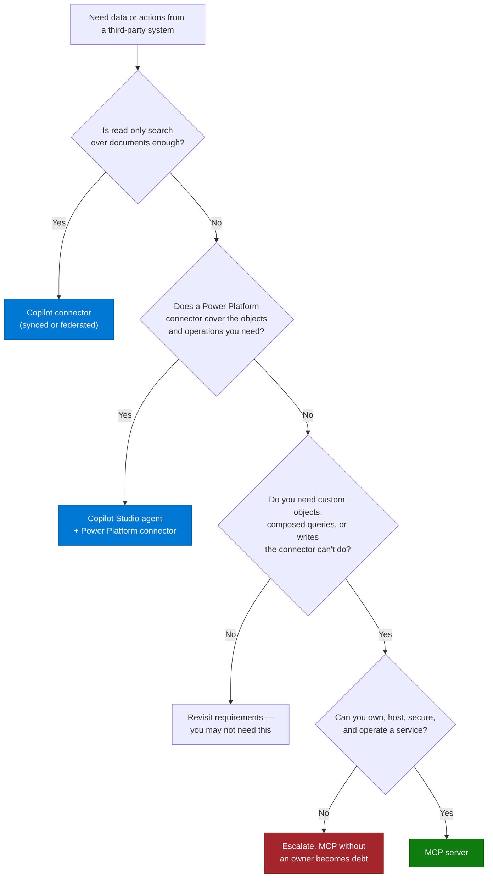
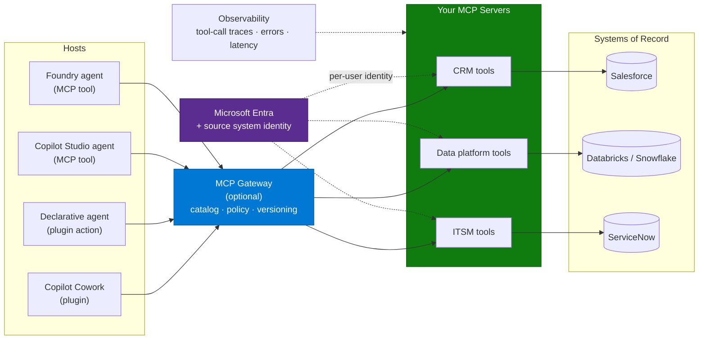
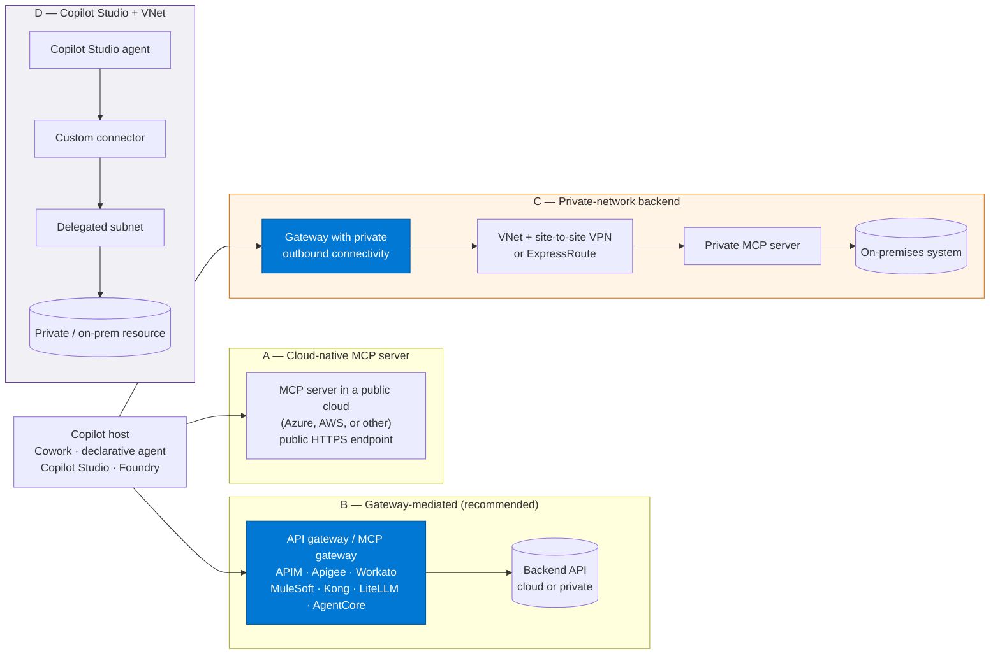
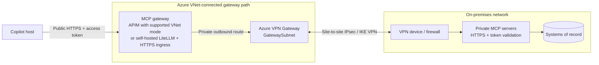
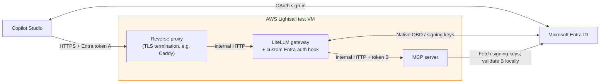
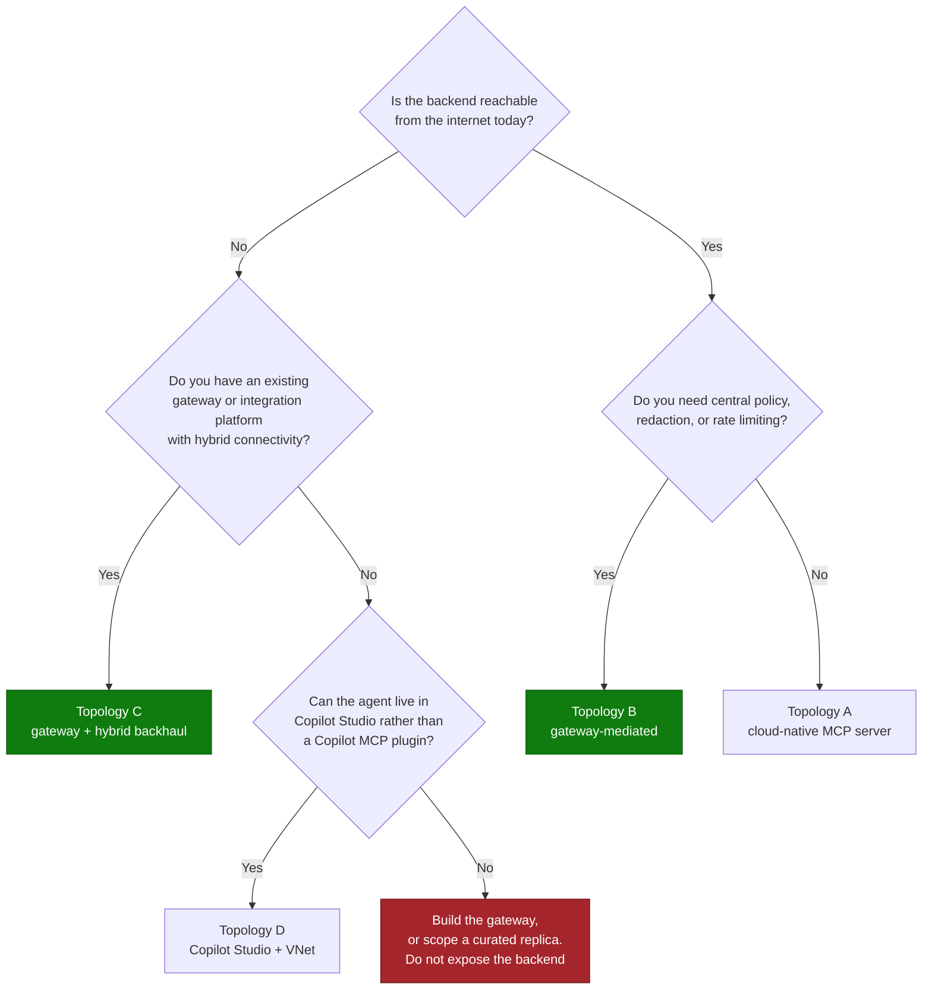

# MCP Server Integration Pattern

> **How third-party systems reach Copilot when connectors are not deep enough.** Model Context
> Protocol servers expose enterprise systems as tools that Copilot Cowork, declarative agents,
> Copilot Studio agents, and Foundry agents can call — with your schema, your query logic, and
> your authentication.

---

## Why This Pattern

| Signal | Evidence |
|---|---|
| **Industries** | All. Concentrated where the system of record is heavily customised — CRM, ITSM, HR, data platforms, engineering tooling |
| **Systems seen in the field** | Salesforce, Workday, ServiceNow, Databricks, Snowflake, GitHub, SharePoint Lists, and customer-built platforms |
| **Typical trigger** | "The standard connector only gives us basic fields — we need custom objects and write access" |
| **Where it appears** | Cowork plugins, declarative agent actions, Copilot Studio tools, Foundry agent tools |

MCP has become the default answer when the out-of-the-box integration is too shallow. That
makes it a genuinely reusable pattern — and also one where the same five mistakes recur.

---

## When MCP Is the Right Answer

Work through this before committing. An MCP server is a service you own forever.

| Integration option | Reach | Write | Ownership burden |
|---|---|---|---|
| Copilot connector (synced) | Indexed content, permission-trimmed | ❌ | Low — configuration |
| Copilot connector (federated) | Live fetch via MCP, no indexing | ❌ read-only | Low |
| Power Platform connector | Connector-defined operations | ✅ | Low–medium |
| **MCP server** | Whatever you expose | ✅ | **High — a real service** |

---

## Architecture

A gateway is optional and worth it once you have more than two or three servers: a single
catalog, one policy enforcement point, one place to manage protocol versions. It also adds a hop
and its own version constraints — see the authentication section.

---

## Deployment Topologies — Cloud, Gateway-Mediated, and On-Premises

### The constraint to design around

For the public remote-MCP path in topologies A–C, Copilot hosts call an endpoint **outbound
over HTTPS from the Microsoft cloud**. That endpoint can be a gateway; the MCP servers behind
it need not be public. A VPN from your Azure VNet to on-premises does not, by itself, give the
Copilot SaaS host access to that VNet. The gateway needs private outbound connectivity to the
MCP servers. Do not confuse this with the Power Platform connector path in topology D.

That single fact shapes every enterprise integration in this pattern, because the systems worth
integrating — core banking, policy administration, ERP, MES, clinical systems — are very often
on-premises or in a private network by policy.

**You do not solve this by exposing the backend. You solve it by putting a mediation layer in
front of it.**

### Why a mediation layer, beyond reachability

Even when the backend *is* cloud-reachable, putting a gateway in front of it is usually the
right call. The gateway is where you enforce what the agent — and by extension the user — is
allowed to do:

| Concern | What the mediation layer does |
|---|---|
| **No direct backend access** | The agent never holds backend credentials. It holds a token for the gateway |
| **Least privilege** | The gateway exposes a curated subset of operations, not the whole API surface |
| **Field-level control** | Redact, mask, or drop fields before the payload ever reaches the model |
| **Payload shaping** | Trim and bound responses so the token window is not blown by raw records |
| **Rate limiting and quota** | An agent in a retry loop cannot take down the core system |
| **Authentication translation** | Entra token in, backend credential out — the backend keeps its own auth model |
| **Audit** | One place that records who called what, with which arguments |
| **Blast-radius control** | Write operations can be capped, throttled, or gated centrally |
| **Backend independence** | Swap or version the backend without touching the agent |

This is the same argument as a classic API façade, with one addition: the consumer is a language
model, so **payload shaping and field-level redaction move from good practice to control**.

### Topology options

| Topology | Use when | Trade-off |
|---|---|---|
| **A — Cloud-native MCP server** | Backend is already cloud-reachable; you want full control of tool shaping | You build and operate everything, including policy |
| **B — Gateway-mediated** | You have existing APIs and a gateway; you want policy centralised | Gateway becomes a dependency and a version constraint |
| **C — Private-network backend behind a gateway** | The MCP server itself, or its system of record, is on-premises | Gateway outbound VNet connectivity plus VPN or ExpressRoute; private DNS, return routes, and latency matter |
| **D — Copilot Studio + VNet subnet delegation** | The agent can live in Copilot Studio and you need private outbound connectivity | Not an MCP plugin path for Microsoft 365 Copilot; scoped to Power Platform |

Topologies B and C are the same architecture with a different backhaul. In practice, most
regulated enterprises land on C.

The gateway and MCP compute in topologies A–C are not tied to Azure: they can run in AWS,
Google Cloud, or another approved environment. The host-facing endpoint must be reachable over
trusted HTTPS, with compatible MCP transport, authentication, and tenant policies. Private MCP
servers can remain behind that endpoint. Topology D's Power Platform VNet integration is
Azure-specific; other-cloud backends still need supported connectivity. See
[Hosting the Gateway and MCP Servers on Other Clouds](#hosting-the-gateway-and-mcp-servers-on-other-clouds)
below.

### Azure API Management as the MCP gateway

APIM can expose a managed REST API as a remote MCP server, and can also front an **existing
MCP-compatible server hosted outside APIM**. That second capability is the one that matters for
on-premises: your MCP server stays inside the network, APIM is the internet-facing endpoint.

Verified specifics worth knowing before you design:

| Item | Detail |
|---|---|
| Tiers | Developer, Basic, Basic v2, Standard, Standard v2, Premium, Premium v2 |
| API types | HTTP-compatible APIs only |
| Supported MCP surface | Tools. **Not** MCP resources or prompts |
| Workspaces | MCP server capabilities are not supported in APIM workspaces |
| Policy scope | Policies apply to all operations exposed as tools; global scope evaluates before MCP server scope |
| Useful policies | `rate-limit-by-key`, `trace` with custom metadata (for example an agent identifier), `set-header` to attach backend tokens |
| Endpoint shape | `https://<apim-name>.azure-api.net/<api-name>-mcp/mcp` |

Two failure modes that cost people days:

- **Do not touch `context.Response.Body` in MCP server policies.** It triggers response
  buffering, which breaks the streaming behaviour MCP requires.
- **Turn off response-body logging at the all-APIs scope.** Set *Number of payload bytes to log*
  for Frontend Response to `0` globally, then enable it selectively per API. Leaving it on at
  global scope breaks MCP streaming. This presents as an intermittent transport failure with no
  obvious cause.

Documented troubleshooting: a `401` from the backend usually means the authorization header was
not forwarded — attach it with `set-header`. "Works in APIM, fails in the agent" is almost always
an incorrect base URL or a missing token.

### Third-party gateways and integration platforms

The same architecture, different product. All of these are being used in front of enterprise
APIs for agent consumption:

| Platform | Typical fit | What to verify first |
|---|---|---|
| **Azure API Management** | Azure-centric estates; native MCP server support | Tier, workspace limitation, streaming/logging config |
| **Google Apigee** | Existing Apigee estate, often alongside Okta or another IdP | MCP protocol version support; the OAuth hop through the IdP |
| **Workato** | Integration-platform-led organisations; recipe-based connectivity and an on-premises agent | How tools are shaped and bounded; whether payloads can be trimmed |
| **MuleSoft** | Existing API-led connectivity programmes | Same — tool granularity and payload shaping |
| **Kong / other API gateways** | Kubernetes-centric platform teams | MCP transport support (streaming), auth flows |
| **LiteLLM** | Self-hosted MCP gateway, optionally alongside model proxying; no model provider required for MCP-only use | Pinned release's native Entra OBO configuration, custom inbound-token validation, and host/transport compatibility |
| **AWS AgentCore MCP Gateway** | Multi-cloud estates standardising an MCP catalog | Protocol version parity with the Copilot host |

**The single most important check across all of them is protocol version.** Modern
three-legged OAuth flows and URL elicitation depend on later MCP protocol revisions. If the
gateway requires a newer revision than the Copilot host implements, the integration fails at
authentication with no version diagnostic. This has blocked real enterprise architectures where
the gateway, the custom MCP servers, and the backends were all correct.

Reconcile the version across **host → gateway → server** before writing a single tool.

### LiteLLM as a self-hosted MCP gateway

The documented Copilot Studio integration uses LiteLLM as an MCP-only gateway, with a custom
Entra authentication hook and **native LiteLLM On-Behalf-Of (OBO) token exchange**. It does not
require model proxying. Keep inbound validation and downstream token exchange separate:

| Item | What was true in practice |
|---|---|
| **Custom inbound validation** | The `custom_auth` hook validates token A's signature, issuer, audience, lifetime, tenant, token version, delegated scope, allowed client, and user identity. It rejects credential-override headers and restricts the permitted MCP server. It does **not** perform OBO |
| **Native Entra OBO** | The pinned runtime is configured with `auth_type: oauth2_token_exchange` and `token_exchange_profile: entra_obo`, the tenant token endpoint, gateway client credential, and backend `api://<backend-api-id>/.default` scope. LiteLLM exchanges token A for backend token B |
| **The backend still validates independently** | The MCP server behind the gateway does not trust the gateway blindly — it validates the token it receives (audience, issuer, expected client) on its own. The gateway hop does not replace backend-side auth |
| **Version pinning matters more here than with a managed gateway** | Because the auth hook reaches into LiteLLM's internal request-handling API, a LiteLLM upgrade can silently break the hook. Pin the image by digest, and re-test the hook against every upgrade before rolling it out |
| **`model_list` can be empty** | When LiteLLM is used purely as an MCP gateway — no LLM calls proxied through it — its model configuration can be left empty. It is being used for its request-handling, auth-hook, and MCP-routing pipeline, not its model-proxy features |
| **TLS termination is a separate concern** | Caddy exposes the approved MCP route over trusted HTTPS and forwards it to LiteLLM; LiteLLM calls the private MCP backend. Neither application's port is published. Management routes are blocked; an anonymous liveness route is not anonymous tool access |

Three separate Entra registrations establish the boundaries:

| Registration | Role |
|---|---|
| Copilot OAuth client | Signs in the connection user and requests the gateway's delegated scope; token A targets the gateway |
| LiteLLM gateway | Validates token A, then uses its own credential and delegated permission to obtain token B for the MCP API |
| MCP backend API | Validates token B independently, including its own audience and the gateway as the allowed calling client, not the Copilot client |

Configure delegated consent on both hops and register the exact callback generated by Copilot
Studio on the OAuth client. Keep the Copilot client credential separate from the gateway OBO
credential. Do not forward token A unchanged to an API with a different audience or substitute
an app-only token for delegated identity.

**Do:** test the custom validator, native exchange configuration, backend validation, and
request-local identity isolation separately, then prove signed-in discovery and invocation from
the intended host. Pin the runtime and retest on upgrades; the configuration above describes the
documented version, not a guarantee for every LiteLLM release.

### Reaching on-premises backends

Options, in the order most enterprises should consider them:

| Approach | How it works | Notes |
|---|---|---|
| **Gateway with hybrid connectivity** | Internet-facing gateway; backhaul to on-premises over ExpressRoute, VPN, or a self-hosted gateway component | The mainstream answer. Keeps the backend unexposed |
| **MCP server in a DMZ / perimeter network** | Server sits in the perimeter with tightly controlled routes to the core system | Viable where the network team is comfortable; still needs a public HTTPS ingress |
| **Copilot Studio + VNet subnet delegation** | Power Platform outbound traffic runs in a delegated subnet with access to private resources | Not an MCP path for Microsoft 365 Copilot. Custom connectors and specific connectors only |
| **On-premises data gateway** | Azure Service Bus relay for Power Platform connectors | Connector path, **not** MCP. Outbound only — TCP 443, 5671, 5672, 9350–9354 |
| **Curated cloud replica** | Publish a scoped, read-only projection of the data to a cloud store | Introduces a copy of regulated data. Make that a deliberate decision |

Constraints that trip up the Copilot Studio + VNet route specifically:

- Supported environment types: Production, Default, Sandbox, Developer. **Not** Trial, **not**
  Dataverse for Teams.
- The VNet must be in the Azure region pair matching the Power Platform region — for example
  Canada maps to `canadacentral` and `canadaeast`, Australia to `australiasoutheast` and
  `australiaeast`. Both regions must be delegated for failover.
- **TLS certificates on the endpoint must chain to a well-known root CA.** A private or internal
  root CA is not supported, and this is a very common on-premises blocker.
- Custom DNS in the VNet *is* used, so endpoints must resolve there — DNS resolution failures
  through a delegated subnet typically surface as `502` errors from the connector rather than as
  a name-resolution error.
- Subnet IP range and VNet DNS address cannot be changed while delegation is active.
- Enabling VNet support can break existing calls to public endpoints. Audit outbound
  dependencies first.
- GCC is not supported for VNet; GCC High and DoD are.

And for the on-premises data gateway: updates are **not** installed automatically and ship
monthly, and the recovery key set at install is required to relocate or restore it. Both are
handover items, not footnotes.

### On-premises MCP servers through an Azure VNet and site-to-site VPN

This is topology C with the **MCP servers themselves on-premises**, not just their data sources.
Keep the MCP endpoints on private addresses. Publish only the authenticated gateway endpoint
that the Copilot host can reach, and connect the gateway's outbound network to on-premises:

The MCP gateway proxies application requests; **Azure VPN Gateway only transports network
traffic**. It does not discover tools, validate OAuth tokens, or replace an MCP gateway. A
point-to-site VPN on a developer laptop does not provide this service-to-service path.

| Design area | Required decision or check |
|---|---|
| Gateway network attachment | For APIM, select a tier **and networking mode** supporting private outbound access, such as Standard v2/Premium v2 outbound VNet integration or classic Developer/Premium external VNet injection. MCP support alone does not imply VNet support; Developer is not a production tier. For LiteLLM, use VNet-connected compute with private routes and controlled HTTPS ingress |
| Subnet separation | Keep the MCP gateway workload/integration subnet separate from `GatewaySubnet`. APIM v2 outbound integration requires a dedicated delegated subnet in the same region/subscription, sized and secured according to its networking requirements |
| VPN resources | Dedicated `GatewaySubnet`, Azure VPN Gateway, a local network gateway representing the on-premises peer/prefixes, and an S2S connection to a compatible VPN device with agreed IPsec/IKE settings |
| Addressing and routing | Non-overlapping address spaces; advertised/static routes to the MCP subnets and return routes to the gateway workload subnet. Check BGP propagation, UDRs, and any firewall/NAT effects on the source address |
| Hub-and-spoke | If the VPN terminates in a hub, configure gateway transit on the hub peering and use of the remote gateway on the spoke where supported. Peering alone is not transitive routing |
| Private DNS | Resolve on-premises MCP FQDNs from the actual gateway runtime using approved DNS forwarding, for example Azure DNS Private Resolver outbound rules to on-premises DNS. Permit DNS traffic and use hostnames matching backend certificates |
| Firewall scope | Permit only the required gateway-to-MCP HTTPS destinations/ports and DNS flows; separately permit VPN establishment at the perimeter. Preserve required platform/identity egress. Do not publish MCP listener ports to the internet |
| TLS and identity | Use HTTPS to each on-premises MCP server with hostname and chain validation. Configure backend CA trust where the gateway supports it; never disable validation. The VPN does not replace per-user authorization, audience checks, or OBO where required |
| Operations | Monitor tunnel/BGP state, DNS, gateway errors, and tool latency. Test tunnel interruption/recovery, streaming timeouts, and idempotent retries; plan gateway and VPN resilience for production |

An **inbound private endpoint on APIM is not outbound VNet integration**. It neither creates a
route to on-premises nor makes a private-only gateway reachable by a public Copilot host. Keep
the host-facing ingress and private backend connectivity as separate design decisions.

This gateway-mediated path does not require Power Platform subnet delegation: the gateway,
not Copilot Studio, uses the VPN. Topology D remains a separate connector-specific option.
For an AWS-hosted gateway, the analogous design uses a VPC-connected runtime and AWS
Site-to-Site VPN (or Direct Connect); do not assume the single-VM Lightsail test below already
provides that hybrid path.

### Hosting the Gateway and MCP Servers on Other Clouds

The gateway, reverse proxy, and MCP servers can run on Azure, AWS, Google Cloud, or other
approved infrastructure, together or in different networks with explicit connectivity. Hosting
location and identity provider are independent decisions: in this Entra-based design, moving
compute to AWS does not require replacing Entra with AWS IAM or Cognito. Reachability alone is
not sufficient; transport, authentication, tenant data policies, residency, latency, and
cross-cloud data-transfer costs also need review.

This came up concretely with **LiteLLM as the MCP gateway hosted on AWS**, standing in front of
an MCP server on the same host, both reachable only through a TLS-terminating reverse proxy:

The documented test used Docker Compose on one Amazon Lightsail VM. Internal proxy-to-gateway
and gateway-to-MCP hops used **unencrypted HTTP on that same host**, with independent token
validation; that shortcut must not be carried into cross-host or on-premises connections.

**Evidence as of September 14, 2026:** both applications were healthy, trusted HTTPS and
TLS 1.2/1.3 worked, HTTP redirected to HTTPS, private backend connectivity passed, and public
missing/invalid-token requests and unapproved routes were rejected. **Still pending:** Copilot
client credential/callback completion, real delegated OBO, signed-in tool discovery/invocation,
two-user isolation through Copilot, and load acceptance. Health checks establish deployment
readiness, not successful end-to-end delegated access.

On the small test host, LiteLLM's first startup took about four minutes with substantial swap
activity. Allow an appropriate startup grace period, but measure memory and latency under real
OBO traffic before sizing production; healthy idle containers do not prove concurrent capacity.

Reasons a team ends up here rather than on Azure:

- **Existing footprint.** The team's infrastructure, observability, and operational muscle
  memory are already on another cloud, and the MCP server is one more workload on that estate
  rather than a reason to add a second cloud.
- **Cost of a throwaway test.** A single low-cost VM running the gateway, the MCP server, and a
  TLS-terminating reverse proxy as containers is enough to validate the identity flow end to end
  before committing to a production-grade managed gateway anywhere.
- **Platform standardisation.** If LiteLLM (or another self-hosted gateway) is already the
  organisation's standard AI gateway, keeping the MCP path on the same product and the same cloud
  avoids a second policy surface to operate.

What does **not** change when the hosting cloud changes:

| Still true regardless of hosting cloud | Why |
|---|---|
| The backend validates its own tokens | The gateway hop is a policy point, not a trust boundary the backend can skip |
| Protocol version must reconcile across host → gateway → server | This is an MCP-protocol constraint, not a cloud constraint |
| Secrets need a managed store, not a file on disk | A single-VM test setup with a root-protected secret file is acceptable for a bounded test; it is not an operating model |
| Everything not explicitly exposed should be blocked at the proxy | Same "curated public surface" principle as Topology B/C above |
| A named owner runs it | Moving cloud does not remove the operating burden discussed later in this pattern |

What is a **deliberate simplification for a low-cost test**, and should not be read as the target
state: one VM for everything, no autoscaling or high availability, no managed secret store, and
local log rotation instead of a centralised logging service. Treat this as a fast way to prove
the delegated-identity path works, then decide separately whether the production home for that
gateway is a managed cloud service (on any provider) rather than a single host.

### Corporate proxy and egress

Regulated environments frequently sit behind an inspecting proxy. Long-lived streaming
connections have been closed prematurely by standard proxy configurations, which presents as
timeouts on longer-running agent operations. Include proxy behaviour in the connectivity spike —
test a long, streaming request, not just a short one.

### Choosing a topology

> 📌 In regulated sectors, assume topology B or C. A design that requires exposing a core system
> directly will not clear security review, and proposing it costs credibility.

---

## The Five Recurring Mistakes

### 1. Exposing the API instead of the work

The most common failure. A server that offers `run_query(sql)` or one tool per object pushes
schema knowledge into the model, which then composes wrong queries confidently.

**Do:** design **task-shaped** tools — `get_account_360`, `get_pipeline`, `get_incident_history`
— that compose server-side and return a bounded, field-selected payload.

### 2. Too many tools

Platform behaviour makes this concrete rather than aesthetic:

- A declarative agent with **up to five plugins** injects all of them into the prompt. Beyond
  five, selection is by **semantic match on the plugin description**, not on individual tools.
- When a plugin matches, **all of its tools are returned** — even if one matched.
- Response quality **degrades beyond roughly 10 tools**, and the token window truncates large
  content in both directions.

**Do:** target 5–8 tools per plugin. Split along clean domain boundaries rather than adding an
eleventh tool. Invest real effort in the plugin description — it is what selection runs on.

### 3. Treating identity as a configuration step

Per-user identity is the difference between an agent that respects source-system permissions and
one that fails security review. It is a design constraint, not a setting.

Known friction, observed repeatedly:

| Issue | Effect |
|---|---|
| Identity passthrough is not guaranteed across every surface | The server may receive only a managed identity when the agent is published to Microsoft 365 Copilot or Teams, even though per-user identity worked in the development playground |
| Protocol version gates modern auth flows | Three-legged OAuth and URL elicitation depend on later MCP protocol revisions than some hosts implement. Mismatch presents as an auth failure with no version diagnostic |
| Gateways impose their own version and flow | The chain is only as capable as its least capable hop |
| Actions running as the maker rather than the user | Source-system ACLs bypassed and audit trails wrong |

**Do:** run a `whoami` spike first — a one-tool server that reports the identity it actually
receives, invoked from the real host by a real user. Five lines of code, days saved.

### 4. No observability, opaque failures

Agent-mediated tool calls fail in ways that are hard to diagnose from the chat surface: partial
completion of a multi-step task, a generic "something went wrong" even when some steps
succeeded, and retries that create duplicate records because the first attempt half-succeeded.

**Do:**
- Log every tool call: caller, tool, redacted inputs, duration, outcome.
- Return **structured, actionable errors** the model can relay usefully.
- Make writes **idempotent** on a client-supplied key.
- Emit traces to Application Insights or equivalent, and keep them.

### 5. Forgetting that dynamic discovery removes your release gate

MCP plugins resolve tools **dynamically at runtime** by default. A change to your server changes
agent behaviour immediately, with no repackaging and no approval step.

**Do:** either pin the tool set in the manifest where you need a change-control boundary, or
adopt the rule that **every MCP server deployment triggers a re-run of the agent evaluation
set**. Treat server releases as agent releases.

---

## Design Checklist for a Tool

For each tool, answer before writing code:

| Field | Guidance |
|---|---|
| **Name** | Verb-noun, unambiguous across the whole plugin |
| **Description** | Written for a model choosing between tools. State what it returns and when to use it |
| **Inputs** | Minimal and strongly typed. Avoid free-text parameters that invite invented values |
| **Output shape** | Explicit field list, never "the record" |
| **Payload bound** | Top N plus a total count. Silent truncation produces confidently incomplete answers |
| **Read or write** | Writes need confirmation semantics and idempotency |
| **Latency budget** | Seconds. Long-running work should return a handle, not block |
| **Failure modes** | Each one returns a specific, readable error |

---

## Real-World Scenarios

### Scenario A — CRM depth for sales workflows
A cybersecurity software vendor tested Copilot with its CRM for roughly a year across the
out-of-the-box connector, a first-party sales agent, and alternative architectures. The
connector exposed only basic standard fields, no custom objects or custom fields, could not
compose a full query, and had no write capability — so it could not support account planning,
deal tracking, or pipeline updates.

**Resolution:** a purpose-built MCP server exposing task-shaped tools over the full schema,
consumed by Copilot Cowork. See
[CRM Account Planning Cowork Agent](../../01-scenarios/CRM-Account-Planning-Cowork-Agent/1.Overview.md).

### Scenario B — Data platform tools for agent workflows
A data-protection vendor building production multi-agent systems on a competing platform could
define deterministic tools over their data platform quickly. Reproducing the same agents against
Copilot Studio stalled on exposing those data-platform MCP tools to child agents with
Entra-based identity, without SQL-over-REST workarounds or instruction bloat.

**Lesson:** validate MCP tool availability **at the specific agent level you intend to use** —
main agent versus child agent behaviour is not always identical.

### Scenario C — Engineering tooling with multi-step tasks
An insurer connected an agent to a source-control MCP server. Multi-step prompts completed
partially — an issue created but not assigned or branched — with generic error messages that did
not identify the failed step, and retries producing duplicates.

**Lesson:** multi-step tool orchestration needs idempotency, step-level error reporting, and
telemetry. The MCP server was reliable; the *orchestration* was unobservable.

### Scenario D — Enterprise data warehouse
An institute integrating a data warehouse found the out-of-the-box connector returning
inconsistent results and querying incorrect tables, with a suspected defect affecting MCP calls.
Trust in agent outputs collapsed before the solution reached production.

**Lesson:** when the retrieval layer is non-deterministic, no amount of prompt work recovers it.
Prove tool-level correctness standalone before wiring it to an agent.

### Scenario E — Documented tool not exposed
A team building a complaint-triage agent found a documented MCP tool absent when the server was
connected to their agent.

**Lesson:** enumerate the tools the host actually resolves, in the host, before designing around
documentation. What the docs describe and what a given host surfaces are not always the same set.

### Scenario F — LiteLLM gateway, hosted off-Azure, for a Copilot Studio agent
A financial-services team wanted Copilot Studio's agent talking to an MCP server through
LiteLLM on AWS, using each connection user's Entra identity end to end. The implementation
separated a custom inbound-token validator from native LiteLLM OBO, with independent validation
at the MCP API. Caddy, LiteLLM, and the MCP server were deployed together on a Lightsail test VM.
Hosting outside Azure did not require changing the identity provider.

**Result:** HTTPS, application health, private connectivity, and negative-auth checks passed.
Signed-in OBO, tool invocation, two-user isolation, and load acceptance were not yet established
in the recorded AWS results.

**Lesson:** distinguish infrastructure readiness from delegated-identity acceptance. Treat the
custom validator as tested software and native OBO as versioned configuration. Choose the
hosting cloud independently of identity, and do not present a single-host test as production HA.

---

## When to Use / Avoid

| Use MCP when... | Avoid when... |
|---|---|
| Custom objects and custom fields are essential | Standard fields cover the use case |
| You need composed queries or aggregation | Simple document search is enough |
| Write-back is required | Read-only search is enough |
| You need one integration reusable across Cowork, declarative agents, Copilot Studio, and Foundry | Only one host will ever consume it, and a connector exists |
| You can own, host, and operate a service | No team will own it after go-live |
| Source-system permissions must be enforced per user | All users see all data |

---

## Constraints to Design Within

| Constraint | Design response |
|---|---|
| ≤5 plugins injected; beyond that, semantic matching on plugin description | Write the plugin description as a routing instruction |
| All tools of a matched plugin are returned | Keep the tool count low |
| Quality degrades beyond ~10 tools | Target 5–8; split by domain |
| Token window truncates large content | Bound every payload; return counts, not full lists |
| Confirmation defaults: read-only tools do not prompt, mutating tools do | Mark tools correctly; do not defeat the default on writes |
| Dynamic tool discovery by default | Pin, or gate deployments with an evaluation re-run |
| Identity passthrough varies by surface | Run the `whoami` spike in the real surface |
| Protocol version gates auth flows | Reconcile host, server, and gateway versions up front |
| Synchronous orchestration and timeouts | Long work returns a handle; design an async completion path |
| MCP UI widgets are not supported everywhere | Confirm widget support for your target host before designing around it |
| Publishing MCP-backed capability to Copilot surfaces has partner and distribution constraints | Confirm the distribution path early if you are a partner or ISV |

---

## Operating an MCP Server

Once it is in a business workflow, it is production.

| Concern | Practice |
|---|---|
| **Availability** | Monitor and alert. An agent silently losing a tool looks like a quality problem |
| **Latency** | Track per-tool p50/p95. Slow tools become agent timeouts |
| **Errors** | Alert on rate change, not just absolute rate |
| **Secrets** | Managed identity or a vault. No credentials in configuration |
| **Versioning** | Additive changes only where possible. Removing or renaming a tool is a breaking agent change |
| **Change control** | Every deployment re-runs the agent evaluation set |
| **Vulnerability management** | It is a hosted service in the tenant's supply chain and will be scanned |
| **Ownership** | A named owner and a backup. This is the item most often missing |

---

## Related Patterns and Scenarios

- Runbook: [MCP-Server-Integration-Runbook.md](MCP-Server-Integration-Runbook.md)
- [Branded Office Artifact Generation](../Branded-Office-Artifact-Generation/Branded-Office-Artifact-Generation.md) — what happens to the data once it is retrieved
- [Copilot Connector Knowledge Onboarding](../Copilot-Connector-Knowledge-Onboarding/Copilot-Connector-Knowledge-Onboarding.md) — the lighter-weight alternative
- [Agent Publishing & Channel Deployment](../Agent-Publishing-and-Channel-Deployment/Agent-Publishing-and-Channel-Deployment.md) — identity and behaviour across surfaces
- [Agentic Workflow Orchestration](../Agentic-Workflow-Orchestration/Agentic-Workflow-Orchestration.md)
- Scenario: [CRM Account Planning Cowork Agent](../../01-scenarios/CRM-Account-Planning-Cowork-Agent/1.Overview.md)

---

## Reference Documentation

- [Model Context Protocol specification](https://modelcontextprotocol.io/) *(non-Microsoft)*
- [Plugins for Microsoft 365 Copilot](https://learn.microsoft.com/en-us/microsoft-365/copilot/extensibility/overview-plugins)
- [Build plugins from an MCP server](https://learn.microsoft.com/en-us/microsoft-365/copilot/extensibility/build-mcp-plugins)
- [Dynamic tool discovery for MCP plugins](https://learn.microsoft.com/en-us/microsoft-365/copilot/extensibility/plugin-dynamic-tool-discovery)
- [Confirmation prompts for MCP and API plugins](https://learn.microsoft.com/en-us/microsoft-365/copilot/extensibility/plugin-confirmation-prompts)
- [MCP apps — interactive UI widgets](https://learn.microsoft.com/en-us/microsoft-365/copilot/extensibility/plugin-mcp-apps)
- [Show citations with response semantics](https://learn.microsoft.com/en-us/microsoft-365/copilot/extensibility/plugin-citations)
- [Plugin authentication](https://learn.microsoft.com/en-us/microsoft-365/copilot/extensibility/api-plugin-authentication)
- [Add other agents and MCP tools in Copilot Studio](https://learn.microsoft.com/en-us/microsoft-copilot-studio/authoring-add-other-agents)
- [Work IQ in Copilot Studio](https://learn.microsoft.com/en-us/microsoft-copilot-studio/add-work-iq) — Microsoft's own MCP surface, read-only unless an admin enables writes
- [Microsoft 365 Agents Toolkit](https://aka.ms/M365AgentsToolkit)

### Gateway and hybrid connectivity

- [MCP server support in Azure API Management](https://learn.microsoft.com/en-us/azure/api-management/mcp-server-overview)
- [Expose a REST API as an MCP server (APIM)](https://learn.microsoft.com/en-us/azure/api-management/export-rest-mcp-server)
- [Expose an existing MCP server through APIM](https://learn.microsoft.com/en-us/azure/api-management/expose-existing-mcp-server) — the on-premises path
- [Secure access to MCP servers (APIM)](https://learn.microsoft.com/en-us/azure/api-management/secure-mcp-servers)
- [AI gateway capabilities in APIM](https://learn.microsoft.com/en-us/azure/api-management/genai-gateway-capabilities)
- [Policies in Azure API Management](https://learn.microsoft.com/en-us/azure/api-management/api-management-howto-policies)
- [Azure Virtual Network support for Power Platform](https://learn.microsoft.com/en-us/power-platform/admin/vnet-support-overview)
- [Securing outbound connections from Power Platform (whitepaper)](https://learn.microsoft.com/en-us/power-platform/admin/virtual-network-support-whitepaper)
- [On-premises data gateway for Power Platform](https://learn.microsoft.com/en-us/power-platform/admin/wp-onpremises-gateway)
- [Azure ExpressRoute](https://learn.microsoft.com/en-us/azure/expressroute/)
- [APIM virtual networking options](https://learn.microsoft.com/en-us/azure/api-management/virtual-network-concepts) — choose inbound and outbound capabilities separately
- [APIM outbound VNet integration](https://learn.microsoft.com/en-us/azure/api-management/integrate-vnet-outbound)
- [Azure site-to-site VPN setup](https://learn.microsoft.com/en-us/azure/vpn-gateway/tutorial-site-to-site-portal)
- [VPN gateway transit for VNet peering](https://learn.microsoft.com/en-us/azure/vpn-gateway/vpn-gateway-peering-gateway-transit)
- [Azure DNS Private Resolver](https://learn.microsoft.com/en-us/azure/dns/dns-private-resolver-overview)
- [Hub-spoke network topology in Azure](https://learn.microsoft.com/en-us/azure/architecture/networking/architecture/hub-spoke)
- [Apigee documentation](https://cloud.google.com/apigee/docs) *(non-Microsoft)*
- [Workato documentation](https://docs.workato.com/) *(non-Microsoft)*
- [MuleSoft Anypoint Platform](https://docs.mulesoft.com/) *(non-Microsoft)*

### Self-hosted gateways and other-cloud hosting

- [LiteLLM documentation](https://docs.litellm.ai/) *(non-Microsoft)* — proxy/gateway configuration, including custom auth hooks
- [LiteLLM MCP support](https://docs.litellm.ai/docs/mcp) *(non-Microsoft)*
- [Microsoft identity platform: On-Behalf-Of flow](https://learn.microsoft.com/en-us/entra/identity-platform/v2-oauth2-on-behalf-of-flow) — delegated exchange between the gateway and downstream API
- [AWS Lightsail documentation](https://docs.aws.amazon.com/lightsail/) *(non-Microsoft)* — low-cost single-VM hosting for a gateway + MCP server test
- [AWS AgentCore MCP Gateway](https://docs.aws.amazon.com/bedrock-agentcore/) *(non-Microsoft)*
- [Caddy documentation](https://caddyserver.com/docs/) *(non-Microsoft)* — automatic HTTPS reverse proxy, cloud-agnostic
